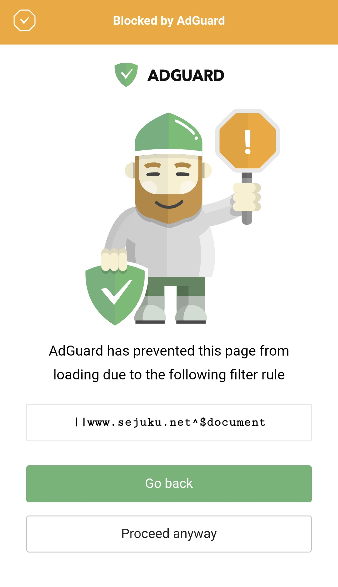

---

title: "[Smartphone and PC] How to Block Access to Annoying Websites with AdGuard"
category: "Tech"
date: "2024-08-29T22:00:00+09:00"
desc: "This article explains how to block access to specific websites using AdGuard. It can prevent you from accidentally opening sites you do not want to visit, so your casual web browsing life may become a bit more comfortable."
tags:
- Adblock

---

> [!NOTE]
> This article was initially translated with GPT-5.5 and then reviewed and edited by the author.

There are probably times when you want to block access to a website with AdGuard. If there is a site that would make you feel bad if you accidentally opened it, just block it in advance.

## Conclusion

To block a site, you can enter something like this:

```regex
||site-i-want-to-block.com^$document
```



If the block succeeds, you will see a screen like this. Good work.

## Explanation

* `||` means that the URL starts with `http://` or `https://`.
* `^` means that the part to the right of that character is no longer part of the URL. This is called a separator character. Incidentally, there are quite a few characters that are not allowed in URLs, such as `^` and `_`.
* `$` applies the filter to the element written on its right. For example, if you write `$img`, it targets all `img` elements. In other words, it blocks all of them.

https://www.ipentec.com/document/web-url-invalid-char

So,

```regex
||site-i-want-to-block.com^$document
```

means something like “block all `document` elements on `site-i-want-to-block.com` when the URL starts with `http://` or `https://`.”

A “document element,” to put it extremely roughly, means “the entire page of that site.”

To explain it a little more precisely, if you have ever written JavaScript, you may have written or seen code like this:

```js
document.getElementById("hoge")
```

This is that `document`. It is not an element like `html`, `p`, or `div`, but rather a top-level object.

https://atmarkit.itmedia.co.jp/ait/spv/1804/06/news031.html

By blocking this whole thing, you can prohibit access to the page. Interesting.

I wonder what would happen if `$document` were changed to `$html`. I have not tried it, but maybe the page would just turn completely white.

## Bonus

The rule shown in the screenshot above is:

```regex
||www.sejuku.net^$document
```

However, while writing this article, I realized that this rule does not block `terakoya.sejuku.net`, which had apparently appeared at some point.

```regex
||*.sejuku.net^$document
```

I thought this might be fine, but after thinking about it more carefully, this would only block subdomains. So in the end, I settled on this:

```regex
||sejuku.net^$document
```

With this, all subdomains are blocked as well. Happily ever after.

## Bonus 2

Even for a blocked site, you can still view the page if you press “Proceed Anyway” at the bottom and ignore the block.

So this is completely useless for something like “I want to prevent my child from looking at naughty sites.” Use DNS blocking or something. That said, I am against filtering, so I will not say anything further.

## References

### Official AdGuard guide

https://adguard.com/kb/general/ad-filtering/create-own-filters/
