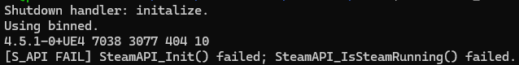
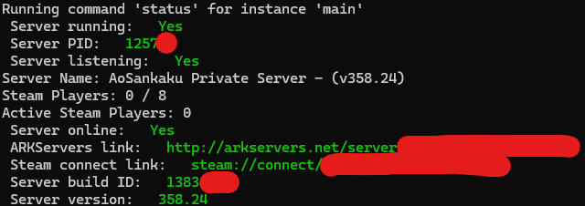

---

title: "[Linux/Ubuntu] Setting Up an ARK: Survival Evolved Server Was a Huge Pain, So I Used a Tool Instead"
category: "Tech"
originalDate: "2025-05-23T03:35:00+09:00"
date: "2026-06-30T13:05:00+09:00"
desc: "I tried setting up an ARK SE server normally with steamcmd, but it mysteriously refused to start and nothing worked, so I used a tool instead. I am leaving the steps here. At the end of the article, I also explain how to disable BattlEye and how to set up a whitelist."
tags:
- Server
- Ubuntu
- Linux
- ARK SE

---

> [!NOTE]
> This article was initially translated with GPT-5.5 and then reviewed and edited by the author.

## Background

When I tried to install it normally with SteamCMD,



I got stuck on this error. On top of that, the screen did not update, so I could not even tell whether the server was open or closed. At that point, I gave up and looked for another method.

## Conclusion

https://github.com/arkmanager/ark-server-tools

Using this solves everything in a fairly rough-and-ready way. If you can read English, just follow the README.md. If you cannot read English, or you can but it is too much of a pain, use the rest of this article as a supplement.

### Warning

There will be various commands in this article, but do not blindly run commands taught to you by strangers on the internet, myself included. Proceed while also reading the official README.

## How to do it

### 1. Log in to the server

Windows will not work here. Use Linux.

If you are using Windows, this article may be useful.

https://mohumohu-tech.com/2022/07/10/ark%E3%82%B5%E3%83%BC%E3%83%90%E3%83%BC%E3%82%92windowspc%E3%81%AB%E6%A7%8B%E7%AF%89%E3%81%99%E3%82%8B/

### 2. Install dependencies

#### Common dependencies

These should basically already be installed, but if you are using some unusual OS, check just in case.

```
>=bash-4.0
>=coreutils-7.6
findutils
perl
rsync
sed
tar
```

#### CentOS and RHEL

Install the following.

```
perl-Compress-Zlib
curl
lsof
glibc.i686
libstdc++.i686
bzip2
```

#### Ubuntu and Debian

For most people, the following command should be fine.

```bash
sudo apt update && sudo apt install perl-modules curl lsof libc6-i386 lib32gcc-s1 bzip2 -y
```

If you are using Debian Buster or Ubuntu 20.04 or older, run this command instead.

```bash
sudo apt update && sudo apt install perl-modules curl lsof libc6-i386 lib32gcc bzip2 -y
```

### 3. Install `arkmanager`

Run the following. If your username is not `steam`, replace it with your own username. In my environment, that alone was enough for it to work without issues.

#### Privileged user, root

If you are not root, do not forget to put `sudo` before `curl` as well.

```bash
curl -sL https://raw.githubusercontent.com/arkmanager/ark-server-tools/master/netinstall.sh | sudo bash -s steam
```

#### Non-privileged user

```bash
curl -sL https://raw.githubusercontent.com/arkmanager/ark-server-tools/master/netinstall.sh | bash -s -- --me
```

That is all.

### 4. Install the server

Run the following.

```bash
arkmanager install
```

If you want to decide the directory name, I feel like there was an option for that. Sorry, I do not know how.

Once you run it, the server should probably be installed under `/home/username/ARK`. If you do not give it a specific name, this server will be named `main`.

### 5. Configure the server

Run the following.

```bash
arkmanager printconfig
```

Then you should see something like this.

```
Running command 'printconfig' for instance 'main'
/etc/arkmanager/instances/main.cfg => arkserverroot
/etc/arkmanager/instances/main.cfg => serverMap
/etc/arkmanager/instances/main.cfg => ark_RCONEnabled
/etc/arkmanager/instances/main.cfg => ark_RCONPort
/etc/arkmanager/instances/main.cfg => ark_SessionName
/etc/arkmanager/instances/main.cfg => ark_Port
/etc/arkmanager/instances/main.cfg => ark_QueryPort
/etc/arkmanager/instances/main.cfg => ark_ServerPassword
/etc/arkmanager/instances/main.cfg => ark_ServerAdminPassword
/etc/arkmanager/instances/main.cfg => ark_MaxPlayers
/etc/arkmanager/arkmanager.cfg => arkstChannel
/etc/arkmanager/arkmanager.cfg => install_bindir
/etc/arkmanager/arkmanager.cfg => install_libexecdir
/etc/arkmanager/arkmanager.cfg => install_datadir
/etc/arkmanager/arkmanager.cfg => steamcmdroot
/etc/arkmanager/arkmanager.cfg => steamcmdexec
/etc/arkmanager/arkmanager.cfg => steamcmd_user
/etc/arkmanager/arkmanager.cfg => steamcmd_appinfocache
/etc/arkmanager/arkmanager.cfg => steamcmd_workshoplog
/etc/arkmanager/arkmanager.cfg => arkserverexec
/etc/arkmanager/arkmanager.cfg => arkbackupdir
/etc/arkmanager/arkmanager.cfg => arkbackupcompress
/etc/arkmanager/arkmanager.cfg => arkwarnminutes
/etc/arkmanager/arkmanager.cfg => arkprecisewarn
/etc/arkmanager/arkmanager.cfg => arkNoPortDecrement
/etc/arkmanager/arkmanager.cfg => arkautorestartfile
/etc/arkmanager/arkmanager.cfg => arkAutoUpdateOnStart
/etc/arkmanager/arkmanager.cfg => arkBackupPreUpdate
/etc/arkmanager/arkmanager.cfg => arkMaxBackupSizeMB
/etc/arkmanager/arkmanager.cfg => msgWarnUpdateMinutes
/etc/arkmanager/arkmanager.cfg => msgWarnUpdateSeconds
/etc/arkmanager/arkmanager.cfg => msgWarnRestartMinutes
/etc/arkmanager/arkmanager.cfg => msgWarnRestartSeconds
/etc/arkmanager/arkmanager.cfg => msgWarnShutdownMinutes
/etc/arkmanager/arkmanager.cfg => msgWarnShutdownSeconds
/etc/arkmanager/arkmanager.cfg => msgWarnCancelled
/etc/arkmanager/arkmanager.cfg => logdir
/etc/arkmanager/arkmanager.cfg => appid
/etc/arkmanager/arkmanager.cfg => mod_appid
/etc/arkmanager/arkmanager.cfg => mod_branch
/etc/arkmanager/arkmanager.cfg => defaultinstance
```

You can probably guess from the output, but if you edit `/etc/arkmanager/instances/main.cfg`, you can change the config for the `main` server.

### 6. Open the ports

The ports that need to be opened are as follows.

* 7777/udp
* 7778/udp
* 27015/udp

Incidentally, the arkmanager README says to open `27016`, but **that is a lie**. Nothing happens. This is because Steam looks for port 27015 by default.

This port can be changed, but that just creates unnecessary extra work. Use 27015.

Also, the README says to open `32330`, but that is the RCON port for remote command execution, so if you are not familiar with it, you should actually avoid opening it. If it gets exposed, people can mess with your server as much as they like.

It also says to open TCP, but ARK SE only uses UDP, so there is no need to open TCP. This README is kind of strange.

### 7. Start the server

Run the following.

```bash
arkmanager start @main
```

`@main` is the server you just created. By using `start`, it runs in the background. You can also use `run` instead, but I do not recommend it because Ctrl+C will not stop it.

As the message says, it takes around 10 minutes for startup to complete. In my environment, it takes about 2 minutes on average. Since it is running in the background, you can log out of the server, or disconnect the session, in this state without any problem.

### 8. Check the server status

Run the following.

```bash
arkmanager status @main
```



If you get a screen that looks roughly like this, you are good.

Still, what exactly is `arkservers.net`? Does opening a server automatically list it there or something...?

### 9. Stop the server

Run the following.

```bash
arkmanager stop @main
```

---

That is all. From here, tweak the settings however you like and turn it into the server you want. Good survival.

## Extra 1: Disabling BattlEye, the anti-cheat

Add the following to `/etc/arkmanager/instances/main.cfg`. If you want to edit something other than `main`, replace `main` accordingly. It is probably fine to put it anywhere.

```cfg title=main.cfg
arkflag_NoBattlEye="true"
```

That is all.

If you are thinking something like:

* I am only playing with friends, so I do not need anti-cheat
* I plan to install mods

then you only need to add this one line, so you may as well do it.

Incidentally, it is not Battl**eE**ye, but Battl**E**ye. Seriously confusing.

## Extra 2: Whitelist

If you want a whitelist, add one more line to `/etc/arkmanager/instances/main.cfg`. Again, if you want to edit something other than `main`, replace `main` accordingly.

```cfg title=main.cfg
arkflag_exclusivejoin="true"
```

The whitelist is not written in the cfg file. It is written in `ShooterGame/Binaries/Linux/PlayersJoinNoCheckList.txt` inside the server folder.

When I asked AI, it told me to put it under `Win64`, and I was completely fooled. So everyone, please do not trust what AI says too much.

Just put Steam IDs in the file, separated by line breaks. You can find a Steam ID by opening the profile in the Steam app or in a browser and checking the number at the end of the URL.


I do not think it is private information, but I hid it just in case. It is quite long, so copy and paste is the sensible option.

## Extra 3: When the server somehow refuses to start, such as after restoring a backup

If you see errors such as `Server has double-forked and cannot be effectively monitored` or `kill: (-5497) - No such process`, the OS permission settings may be messed up. You can fix it with `chmod`.

Move to `ShooterGame/Binaries/Linux` inside the ARK folder, then run:

```bash
chmod +x ShooterGameServer
```

After that, it should work.

## Extra 4: When installation keeps failing for some reason

Check whether you have enough storage. Specifically, you need around 200 GB. Even though this is a dedicated server.

Even when there is not enough storage, it does not tell you that the storage is insufficient.

## References

https://github.com/arkmanager/ark-server-tools/blob/master/README.asciidoc

So README files can be written in AsciiDoc too. First time I have seen that.
