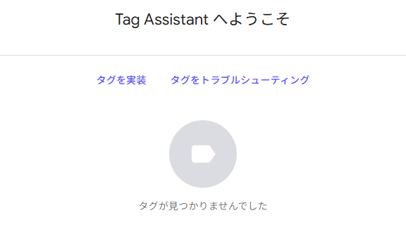
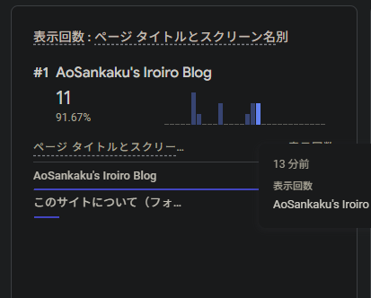

---

title: "[Astro] Tag Assistant Misses GA4 via Partytown"
category: "Tech"
date: "2026-06-30T13:25:00+09:00"
originalDate: "2026-01-02 00:40"
desc: "I tried adding Google Analytics, GA4, and Partytown to Astro. Debugging did not go well, but it seemed to be working after all. Here is what happened."
thumbnail: "./image.png"
alt: "Tag not found, which was a complete lie"
tags:
- Astro
- Frontend

---

> [!NOTE]
> This article was initially translated with GPT-5.5 and then reviewed and edited by the author.

No tags found.



**A complete lie.** The real-time view count is increasing properly.



Are you kidding me?

> [!WARNING] Ad blocker behavior
> Naturally, if you have an ad blocker installed, it blocks trackers and similar things, so Tag Manager and real-time tracking will not work either. Good children should prepare a clean browser for testing.

## Official guide

Astro has an official-looking guide like this.

https://ricostacruz.com/posts/google-analytics-in-astro

I tried various things: implementing it exactly as described there, splitting files, not splitting files, disabling it in the debug environment, and so on. None of it worked properly. I tried all kinds of methods.

## It was Tag Assistant's fault

A fact emerged that almost defeats the purpose of using frameworks like Astro.

While messing around with things, analytics sometimes broke and sometimes did not. When I opened the production environment in Chrome, part of the `<head>` in the console looked like this:

```html
<script 
  type="text/partytown"
  src="https://www.googletagmanager.com/debug/bootstrap?id=G-XXXXXXXXXXXX&amp;src=GTAG&amp;cond=5&amp;gtm=45je5ca1v9180692193za200"
  data-pterror="TypeError: Failed to fetch
    at blob:https://aosankaku.net/485f2106-0b53-4935-9776-168bc6413ebd:2:26390
    at ut (blob:https://aosankaku.net/485f2106-0b53-4935-9776-168bc6413ebd:2:26846)"></script>
```

## Workarounds

### 1: Give up on Partytown

From what I found while looking into this, Partytown seems to be fairly unstable. Giving up on it is one option.

The really painful part is that there is **no alternative method**. Astro is really good, so losing points here hurts badly.

### 2: Try writing it in exactly the same way

I seriously have no idea why, but it seems to work if you split it into components. The logic makes absolutely no sense, though.

For reference, here is a commit where Analytics somehow works.

http://fb26422d.aosankaku-website-2025.pages.dev/blog/partyparrot_streamdeck_plugin/

https://github.com/AoSankaku/aosankaku-website-2025/commit/542e27a1d76783f056dcccce60509b2e054a4cc6#diff-ba00f1d7bc63648f0861e03d786d6f1ed78307f1b40284e4db329586d3df2db2

## Manual checking is the only debugging method

So, since Tag Assistant does not recognize it, there is no debugging method other than **brute force, namely checking the real-time view**.

To begin with, it is probably unavoidable if around half of the traffic is not captured. We live in the great age of tracker blocking. Still, hardcoding an error directly into `data-pterror` feels a bit questionable. I would like that to be fixed.
