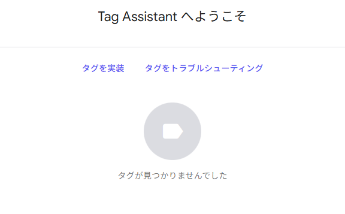
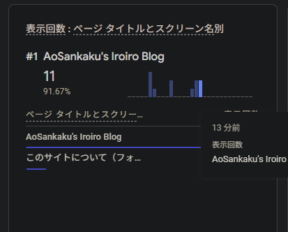

タグが見つかりませんでした。



**大嘘です。** リアルタイムビューはちゃんと増えています。



ふざけやがって。

> [!WARNING] 広告ブロッカーの挙動
> 当然のことながら、Adblockを入れている場合はトラッカーなどを弾くためタグマネージャーやリアルタイムトラッキングなども動作しません。良い子のみんなは検証用のまっさらなブラウザを用意しておきましょう。

## 公式サイトのガイド

Astroの公式ガイドにはこういうものがあります。

https://ricostacruz.com/posts/google-analytics-in-astro

これの通り実装したり、ファイルを分けたりわけなかったり、デバッグ環境で動かないようにしたり…などなど、色々試行錯誤しましたが全くうまくいきません。色々な方法を試しました。

## Tag Assistantのせい

Astroなどのフレームワークを使うメリットを否定するような事実が浮上しました。色々いじっていると、アクセス解析が壊れるときと壊れないときがあります。本番環境をChromeで開いたところ、コンソールの`<head>`の一部がこうなります。

```html
<script 
  type="text/partytown"
  src="https://www.googletagmanager.com/debug/bootstrap?id=G-XXXXXXXXXXXX&amp;src=GTAG&amp;cond=5&amp;gtm=45je5ca1v9180692193za200"
  data-pterror="TypeError: Failed to fetch
    at blob:https://aosankaku.net/485f2106-0b53-4935-9776-168bc6413ebd:2:26390
    at ut (blob:https://aosankaku.net/485f2106-0b53-4935-9776-168bc6413ebd:2:26846)"></script>
```

## 対処法

### 1: partytownを諦める

色々調べた感じ、Partytownはかなり不安定っぽいです。諦めるのも手です。

**代替方法がない**というのが非常に痛いところです。Astro、めっちゃいいのにここで損するの痛すぎる。

### 2: 全く同じ方法で記述してみる

まじでどういうわけかわかりませんが、コンポーネント分割すれば動くっぽいです。理屈が全く通っていませんが。

参考までに、何故かアナリティクスが動作するコミットを貼っておきます。

http://fb26422d.aosankaku-website-2025.pages.dev/blog/partyparrot_streamdeck_plugin/

https://github.com/AoSankaku/aosankaku-website-2025/commit/542e27a1d76783f056dcccce60509b2e054a4cc6#diff-ba00f1d7bc63648f0861e03d786d6f1ed78307f1b40284e4db329586d3df2db2

## デバッグ方法は手動確認しかない

というわけで、Tag Assistantが認識しない以上、デバッグ方法は **気合い（リアルタイムチェック）** をおいて他にありません。

そもそも、トラフィックが半分ぐらい拾えていなくても仕方ありません。世は大トラッカーブロック時代です。でも、`data-pterror`にエラーをベタ書きされるのはちょっとどうなんでしょう。直してほしいですよね。