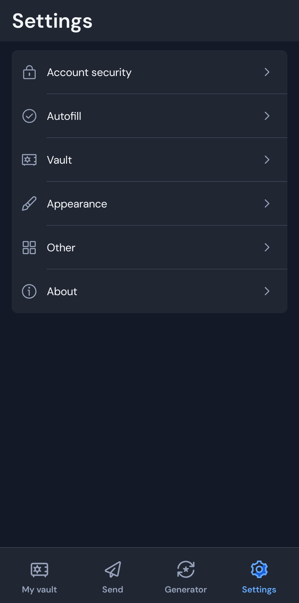
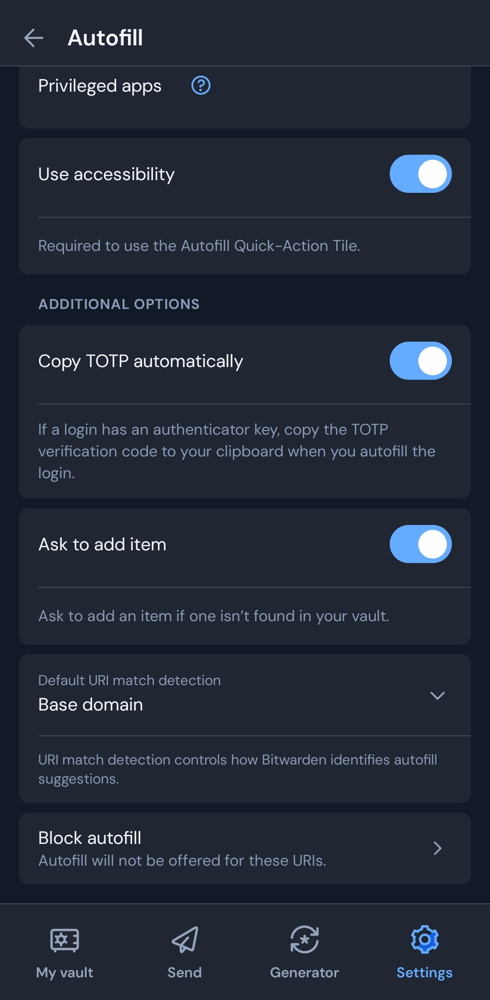
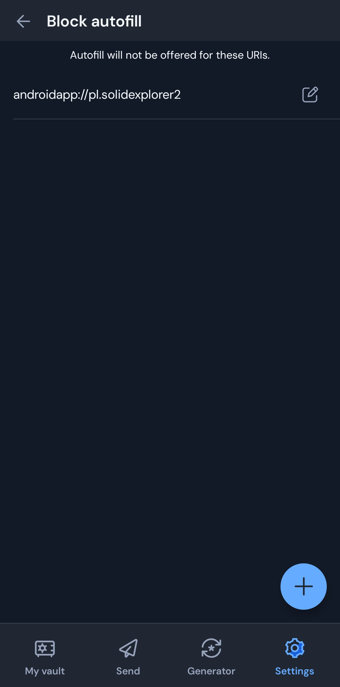
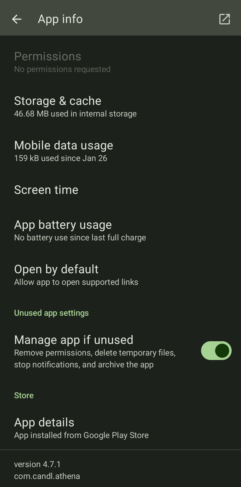

---

title: "Bitwarden Autofill Shows Up in Calculator"
category: "Misc"
date: "2026-06-30T13:40:00+09:00"
originalDate: "2025/12/22"
lastUpdate: "2025-12-31T18:45:00+09:00"
desc: "This article explains how to disable Bitwarden's autofill assistance feature on an app-by-app basis."
thumbnail: "thumbnail.png"
alt: "A finger pressing a calculator"
tags:
- Life
- Bitwarden

---

> [!NOTE]
> This article was initially translated with GPT-5.5 and then reviewed and edited by the author.

Bitwarden’s password autofill assistance feature is convenient. However, even for me, there is absolutely no situation where I want to enter a password while using a **calculator**.

So, let’s disable it on an app-by-app basis.

## Conclusion

Go to:

Settings → Autofill → scroll to the bottom → “Block autofill” → New blocked URI

Then enter the target URI, and that should solve it.







### What is a URI?

From what I found, it is probably a **higher-level concept than a URL**.

A URL like this, which we usually see in everyday use:

```
https://example.com
```

is only one type of notation within something called a URI.

For example, the URI of the calculator app I use, CALCU, is:

```
androidapp://com.candl.athena
```

If Bitwarden’s autofill suggestion appears in your calculator and you go “?”, specifying this should solve the issue.

You can find the app URI at the very bottom of the app information screen.



Just add `androidapp://` before that string.

### Disabling autofill for a specific website

You can also disable autofill for a specific website by specifying a normal string that starts with `https://`.
