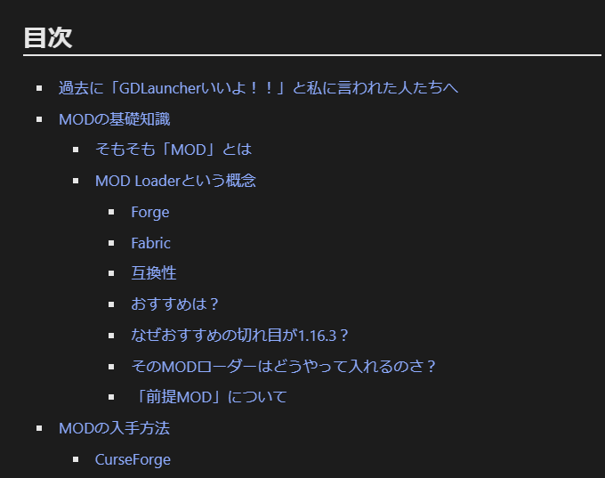
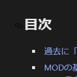

> [!NOTE]
> This article was initially translated with GPT-5.6 and then reviewed and edited by the author.

Today, including drafts, I somehow updated seven blog posts. It really makes me realize once again that I am the kind of person whose output fluctuates wildly depending on my mood.

Anyway, I will explain what has improved since the previous article. Although some of these changes were actually made about a year ago, please overlook that part.

## Automatic updates on push

The original project seems to have something similar, but I had not been using it because it frequently produced errors and the scripts were too old to work properly.

This time, I studied it again and successfully achieved full automation. I wrote about it in detail in the following article, so take a look if you are interested.

[[Gatsby] Automating GitHub Pages Builds Broke the Build Output](../auto_gatsby_build/)

## CSS adjustments

The headings were difficult to distinguish, so I adjusted them. I freely took inspiration from existing WordPress sites and ~~affiliate trash~~ blogs.

Japanese text also now wraps at more natural positions. There may still be places where it does not work properly from time to time.

I also fixed the strange spacing in nested lists.

* Like

  * this,

    * when the list had multiple levels, the spacing above

      * used to
    * become strange
  * for some reason.

## Updated Gatsby from v4 to v5

Nothing particularly troublesome happened. I followed the steps I found through Google, and it went smoothly. I was surprised that it worked properly even though I handled it fairly casually.

Incidentally, the performance score in PageSpeed Insights went down.

Why?

## Automatic YouTube embeds

YouTube videos can now be embedded automatically in a reasonably nice way. The embeds also support responsive design.

However,

```text
`youtube:https://www.youtube.com/watch?v=dQw4w9WgXcQ`
```

causes an error, while:

```text
`youtube:https://www.youtube.com/embed/dQw4w9WgXcQ`
```

does not seem to cause one.

Mysterious. Maybe I should modify it to convert the URL automatically and submit a pull request.

https://rpf-noblog.com/2020-05-07/gatsby-youtube/

This article helped me solve it.

## A table of contents sometimes appears now

Some articles now have a table of contents. I add one to articles that look like they are going to become excessively long.

There is a terrible bug where the build fails forever unless the table of contents is placed at the very end. Be careful if you use this plugin.



## Heading links can now be copied

As shown in the image below, a chain icon now appears to the left of each heading. Clicking it moves you to that heading, and copying the URL gives you a link directly to that location.



This screenshot was taken while the implementation was still broken, so the link appears black even though the site is using the dark theme. It has since been fixed.

## Plans

I still have not successfully implemented that thing where casually pasting a URL automatically turns it into an embed.

I plan to work on it tonight while I still have some motivation.

## Aside: I submitted a few pull requests

I tried submitting several things called pull requests to the original project.

Fortunately, the developer was kind. They were only very minor fixes, but the developer accepted them without any issue. I was fairly happy about that, so I would like to contribute again when I have the time.

https://github.com/sungik-choi/gatsby-starter-apple/pull/59

https://github.com/sungik-choi/gatsby-starter-apple/pull/60
