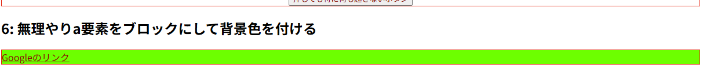
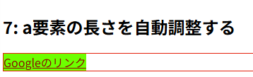
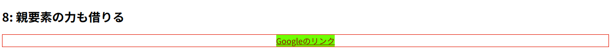

---

title: "[CSS] Why margin: auto Won't Center Buttons"
category: "Tech"
date: "2026-06-30T00:00:00+09:00"
originalDate: "2025-06-23T21:00:00+09:00"
desc: "Since I had been learning HTML and CSS mostly by intuition, there were some basic centering techniques I did not really understand. This is fairly easy to solve, so I will show how to do it."
tags:
- Frontend
- HTML
- CSS

---

> [!NOTE]
> This article was initially translated with GPT-5.5 and then reviewed and edited by the author.

Do you use CSS? I act all smug and use React, but in the end, CSS knowledge is still necessary.

## `margin: auto` does not center it

By the way, `margin: auto;`, which can center all kinds of things, is convenient.

```html

```

If you write it like this, it becomes this.

<br>


<br><br><br>

I randomly pasted an image I had on hand. It is properly centered.

However, there are also things that do not get centered. For example:

```html
<a style="margin: auto;" href="https://google.com">Google link</a>
```

This becomes this.

---

<a style="margin: auto;" href="https://google.com">Google link</a>

---

```html
<button style="color: #990000;" style="margin: auto;">A button that does absolutely nothing when pressed</button>
```

This also does not get centered.

---

<button style="color: #990000;" style="margin: auto;">A button that does absolutely nothing when pressed</button>

---

Why?

## Solution

Looking at it this way, there seem to be two types of things: “things that can be centered” and “things that cannot.”

What determines the difference is the **type** of element. In fact, HTML elements can be divided into **block elements**, **inline elements**, and **inline-block elements**, and these three categories make the difference.

https://developer.mozilla.org/en-US/docs/Web/CSS/display

You can probably understand it by trying things on our beloved MDN site. To put it extremely roughly, for example, [a link like this](https://developer.mozilla.org/en-US/docs/Web/CSS/display) is an `a` element rather than a `p` element, but it can exist inside a sentence without forcing a line break every time. That is because links are inline elements.

If you tell one of these inline elements, “Center yourself!”, it becomes a question of “Center relative to what??????????”, and since it cannot be calculated meaningfully, it does not work.

If an `a` element were a block element, it would look exactly like this. There are no extra line breaks or `<br />` here.

---

<p>Text text text text<a href="https://google.com" style="display: block;">Link</a>text text text</p>

---

Incidentally, this is not some forced reproduction. In fact, with CSS, you can **override** whether an element behaves as a block element, inline element, or inline-block element.

```html
<p>Text text text text<a href="https://google.com" style="display: block;">Link</a>text text text</p>
```

`display: block;` is that thing. In other words, by adding `display: block;` to something that is normally an inline element, you can make `margin: auto;` work fairly easily. Like this.

...is what I would like to say, but because of the blog engine, `button` gets automatically placed inside a `p`, so I cannot center it properly here. Therefore, I will send it through CodePen.

<iframe height="500" style="width: 100%;" scrolling="no" title="Untitled" src="https://codepen.io/aosankaku/embed/XJbyoYP?default-tab=html%2Cresult" frameborder="no" loading="lazy" allowtransparency="true" allowfullscreen="true">
  See the Pen <a href="https://codepen.io/aosankaku/pen/XJbyoYP">
  Untitled</a> by Blue Triangle (<a href="https://codepen.io/aosankaku">@aosankaku</a>)
  on <a href="https://codepen.io">CodePen</a>.
</iframe>

---

Please look at 4 and 5. You can see the difference. 4, the `a` element, fails to center, but 5, the `button` element, is properly centered.

### `a` elements expand horizontally on their own

The `a` element actually has a problem: if you do not specify its width, it **expands horizontally on its own**.

You may think, “No it does not.” Let’s try changing the background color.



It stretched out like this. If it stretches on its own, it cannot be centered.

The solutions are either:

1. Center it by adding `text-align: center;` to the parent element
2. Specify a width, such as `width: 6em;`

Basically, for accessibility reasons, if you are making something that sends the user to a link, using `<a>` is preferable to using `<button>`. So making a “link button” in this state is a little difficult. I wish it would automatically shrink and expand like a button...

For people who feel that way, there is also something called `inline-block`. As you can see in 7, the length is properly adjusted automatically.



However, it is still not centered. Trouble.

```html
<h2>8: Also borrow the power of the parent element</h2>
<div style="border: 1px solid #ff0000; text-align: center;">
  <a href="https://google.com" style="color: #990000; background-color: #00ff00; margin: auto; display: inline-block;">Google link</a>
</div>
```



If you also borrow the power of the parent element, it gets nicely centered. If you want to configure it in a nicer way, I think using flexbox or something similar would be better. Case closed.

### Question: Is forcibly making it a block element bad for accessibility?

To get straight to the point, no matter how much you manipulate things with CSS, people using TTS and similar tools only see the raw HTML. So as long as the HTML structure itself is proper, it should be fine.

## Use block, inline, and inline-block elements well

If you understand, even vaguely, the difference between block elements, inline elements, and inline-block elements, you will probably have fewer moments in CSS where you go, “Yeah, why?” Try making use of them.
