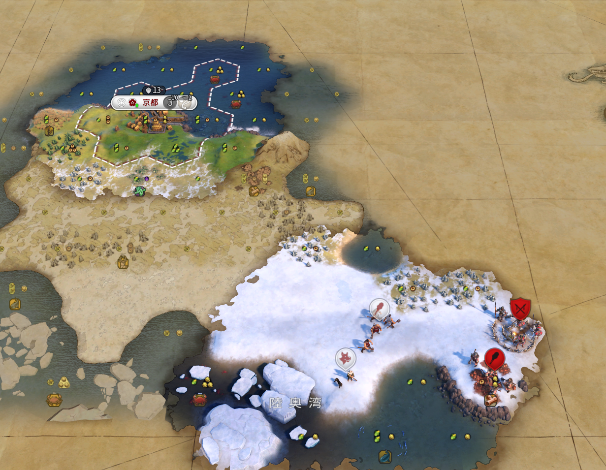
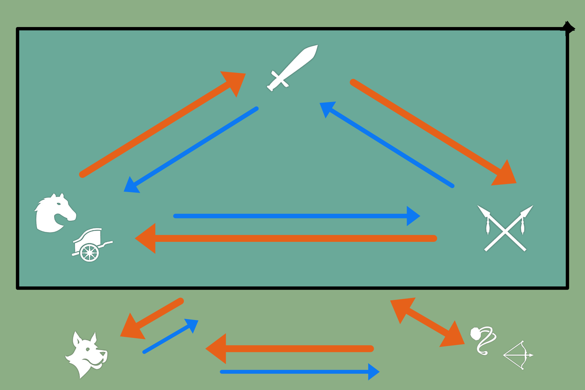
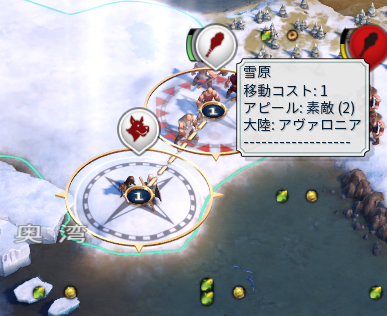
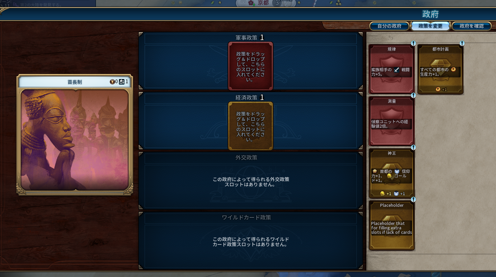

```toc
```

## 第1節　続・戦闘

### 蛮族の掃討

前回の続きです。右下に行ったところ、蛮族の**前哨地**を発見しました。



蛮族の前哨地は、その上を味方が**通過**することで消滅します。ちなみに、潰さないと敵が無限に出現します。

蛮族の強さは、**一番進んでいる文明のユニットと同等**になります。つまり、一人だけものすごく軍事ユニットを開放していると、強い蛮族がうじゃうじゃ湧いてきます。できるだけ早めに潰したいところです。

ちなみに、蛮族の前哨地は**通過**さえすればいいので、相手が前哨地から離れたときに通過すれば前哨地は消滅します（すでに場に出ている蛮族は消滅しません）。通過するユニットは斥候でもOKです。活用していきましょう。

「守りを固める」コマンドや、投石兵で敵を倒す（とどめを刺す）ことで得られる技術ブーストのボーナスを虎視眈々と狙いながら潰していきましょう。この前哨地までは距離があり、迂回路もなさそうなので警戒しながら別の都市出しを優先するのもありだと思います。

### 戦闘の相性

さて、右下の赤いアイコンをよく見てみましょう。「戦士（棍棒のアイコン）」と「槍兵（槍のアイコン）」がいます。

わざわざ2種類いるということは、もちろん戦闘の相性があります。ただし、「戦士vs槍兵」という枠組みではありません。

戦士は「**近接戦闘ユニット**」、槍兵は「**対騎兵ユニット**」です。そのため、計算式は「戦士と槍兵」ではなく、「近接戦闘と対騎兵」となります。

そして…相性表などは、いくら調べても出ません。そのため、わざわざオリジナルで作りました。御覧ください。



もっと複雑な図になると思っていましたが、意外と単純になりました。ちょっと見づらいところに付け加えると、

- 長距離ユニット（投石兵、弓兵など）は、当然射程が長いので攻めに強いが、守りに弱い
- 序盤の偵察ユニット（斥候）は、戦闘向きではない（当分先ですが、偵察ユニットは後々遠距離攻撃ができるようになります）

ということです。

基本的に、わざわざ槍兵を生産することは少ないです。ただしAIはそこそこ槍兵を作ってくるので、騎兵を作るときには注意したいものです。

ちなみに、軽騎兵ユニットと重騎兵ユニットの違いは知りません。てへ。多分軽騎兵のほうが軽々と動けると思います。

### 固有ユニット

言うまでもないことかもしれませんが、リーダーや文明に固有のユニットは**上の相性表をひっくり返すぐらい強い**ことも多々あります。

ただし、相手の固有ユニットの能力を調べる方法はありません。面倒ですが、毎回ググるかシヴィロペディアを見ましょう。

### ユニットの捕獲

戦闘ユニットは、民間人ユニットを捕獲することができます。民間人ユニットは、超簡単に言うと戦闘ができないすべてのユニットのことをいいます。

特に開拓者を取られてしまうと面倒です。開拓者の周りには味方の戦闘ユニットを配置しておきましょう。

### 隊形の組み方

民間人は、戦闘ユニットと**隊形**を組むことができます。隊形を組んだ場合、移動力は低い方に引っ張られるため移動が遅くなるものの、一緒になっている戦闘ユニットが生きている限りその民間人を奪われないというメリットがあります。確かチュートリアルでも説明がありましたね。


なお、斥候は戦闘ユニットのため、他のユニットと基本的には陣形を組めません。



### ちょっと待て！移動力ってそもそもなんだよ

そういえば、ここまで移動力の解説をしていませんでした。なんとなくわかる方はここは飛ばしてOKです。

移動力とは、ユニットごとに持つ移動時に消費する体力のようなものであり、毎ターン上限まで回復します。

タイルの地形（例えば、熱帯雨林や急稜など）は、通過するときに移動力を多く消費することになります。詳しい計算式は気になったら調べてみてください。

とりあえず、**平原じゃないところは移動が大変**ということを覚えておけば大丈夫です。

#### 行商人で道を作ろう

どこかで「行商人はおすすめ」といった気がします（この記事群が長すぎて全く覚えていません）。実は、行商人は**移動に伴って勝手に道路を作ってくれます**。

行商人は生産力が弱い都市が強い都市から恩恵を授かるために使うという使い方もありますが、ついでに道ができるというのはとても魅力的です。

#### 移動力の高い宗教ユニット

このゲームで移動力の高いユニットは、以下のとおりです。

- 斥候系
- 宗教系ユニット
- 偉人（今後解説）
- 戦車（中盤～終盤）
- ヘリコプター（終盤）
- 巨大戦闘ロボット（最終盤）

また、これも終盤の話になりますが、飛行系のユニットは「移動」の概念が特殊なため移動力が高い系とみなしていいと思います。

## 第2節　第2の都市

そろそろ次の都市を出したくなってきました。**このゲームでは、都市の数が正義**です。今回は初期地点付近が終わっていますが、どんなへっぽこ地形の都市でも無いよりはマシです。遠慮なく出していきましょう。

都市の領土は都心から3マス以内で自然に広がりますが、無限に広がるわけではありません。都市の数が少ないと領土が狭くなり、戦略資源の獲得にも不利になります。それに、すべての都市を落とされたらゲームオーバーです。多いほうが有利になるので、ガンガン出しましょう。

開拓者を出すには、2人以上の人口が必要です。前回説明しましたが、文化ツリーで手に入る**植民地化**を入手しスロットにはめることで、開拓者に対する生産力を+50%、つまり開拓者ができるまでの時間が2/3になります（計算式があるので、厳密には違うかもしれません）。

### 都市はとにかく出せ

このゲームは、都市からいろいろなものを生産します。そのため、**都市の数が実際の生産力に直結**します。

<span style="font-size: 2em; font-weight: 900;">とにかく都市を出そう！</span>
<span style="font-size: 2em; font-weight: 900;">とにかく都市を出そう！</span>
<span style="font-size: 3em; font-weight: 900;">とにかく都市を出そう！</span>
<span style="font-size: 3em; font-weight: 900;">とにかく都市を出そう！</span>
<span style="font-size: 4em; font-weight: 900;">とにかく都市を出そう！</span>
<span style="font-size: 4em; font-weight: 900;">とにかく都市を出そう！</span>

一連の記事は色々書いてあって難しかったと思います。でも、これを最初に覚えておけばひとまず大丈夫です。これだけ覚えて帰ってください。今後、こんなデカ文字は二度と登場しません。

## 第3節　政策スロット



文化力がある程度貯まると、このような画面が出ると思います。これを「政策スロット」といいます。

まだ序盤なのでそこまで威力は高くありませんが、後々お金を節約できたり、戦闘力を大幅に上昇させられるなど、強力なカードが出現します。早く開放したい場合は文化力をガンガン上げていきましょう。

どれを選べばいいかは、今の状況を考えれば自ずとわかってくると思います。
