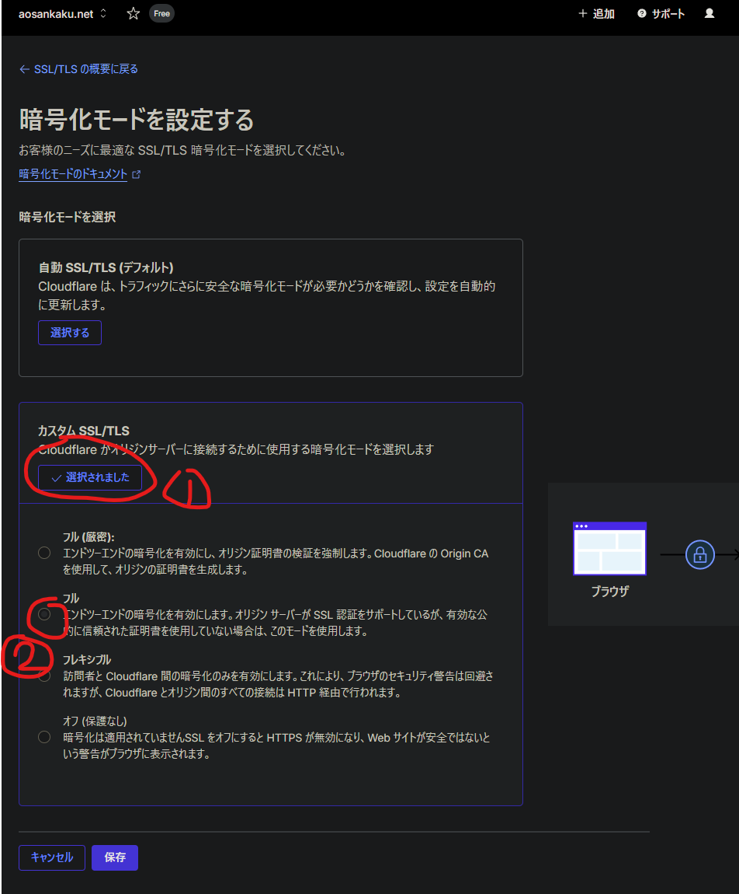

> [!NOTE]
> This article was initially translated with GPT-5.6 and then reviewed and edited by the author.

One day, I discovered that my blog was completely broken.

Why?

## It was Cloudflare's fault

To get straight to the point, it was Cloudflare's fault. While narrowing down the cause, I discovered the following:

* It looked perfectly normal on the `.pages.dev` domain
* Both the local development environment and the build completed without any problems

So I concluded that something had gone wrong around the domain configuration.

Did I then investigate the console and determine the cause myself? No. I threw the whole thing at Gemini. Tee-hee.

> Thank you for sharing the console logs. The cause is now clear.
> The main bottleneck is the `net::ERR_TOO_MANY_REDIRECTS` error occurring while loading the CSS file, `about.Cq37F0yN.css`.

The word “bottleneck” feels slightly questionable here, but apparently the CSS was running into too many redirects. Why?

### Change the SSL/TLS setting

This is where you change it—the setting, that is. Apparently, switching it to Full fixes the problem.

According to Gemini:

> * When using Flexible mode: The connection between the browser and Cloudflare uses HTTPS, but Cloudflare attempts to communicate with the origin server, Cloudflare Pages, over HTTP.
> * How the infinite loop occurs: Cloudflare Pages redirects the request because it expects HTTPS. However, Cloudflare, still using the Flexible setting, sends another HTTP request. This causes the redirect to repeat indefinitely, eventually making the CSS request time out with an error.

Apparently.

Huh. So that can happen.

## Could there be other causes?

I did some research myself afterward. Excluding posts where the project itself appeared to be broken, I found reports of these possible causes as well:

* [Disabling CSS Auto Minify fixed it](https://community.cloudflare.com/t/cloudflare-pages-cloudflare-breaks-css-on-own-domain-works-on-pages-dev/711974)
* [Rocket Loader was interfering with something](https://community.cloudflare.com/t/cloudflare-breaking-js-and-css/327148)

Until now, I had praised Cloudflare Pages without reservation. After seeing it cause a bizarre problem like this, though, I spent the day feeling slightly suspicious of it.

Even when you have no particular reason to do so, you should probably check your own website about once a month. Otherwise, it might quietly turn into a completely different site without you noticing.
