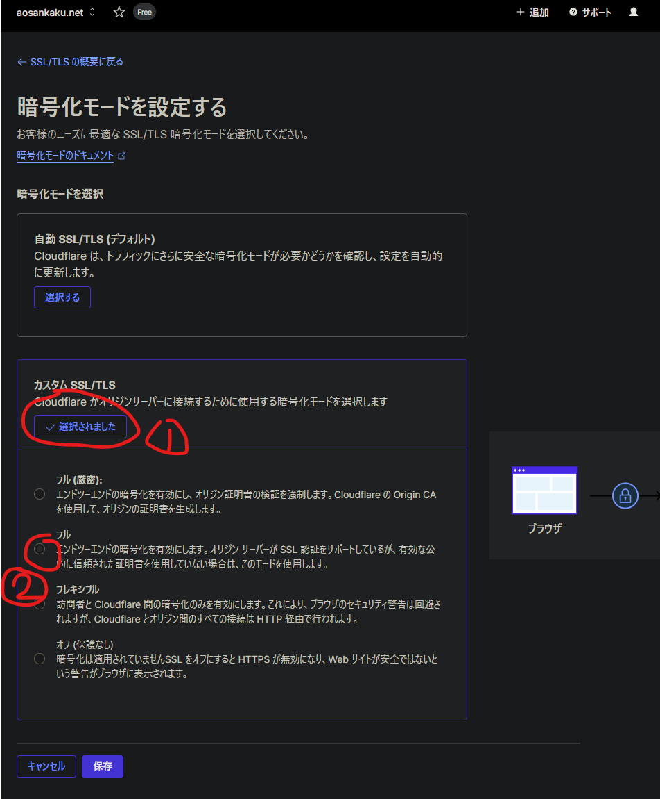

ある日、自分のブログがぶっ壊れてました。

なぜ。

## Cloudflareのせい

結論から言えば、Cloudflareのせいでした。というのも、原因の切り分け中に

- `.pages.dev`だと普通に見える
- ローカル開発環境もビルドも異常なし

という事実が判明したためです。

というわけで、これはドメイン周りがごちゃごちゃになっていると判断。コンソールを見て原因究明…をするでもなくGeminiに丸投げ。てへ。

> コンソールログを共有いただきありがとうございます。原因がはっきりと見えました。
> 一番のボトルネックは、CSSファイル（`about.Cq37F0yN.css`）で発生している`net::ERR_TOO_MANY_REDIRECTS`です。

ボトルネックという表現はなにか引っかかりますが、どうやらCSSがTMRになっていたようです。なんで？

### SSL/TLS設定を変える

ここから変えます、設定を（倒置法）。なんかフルにすると治るらしいです。Gemini氏いわく、

> - Flexibleモードの場合: ブラウザとCloudflare間はHTTPSですが、Cloudflareとサーバー（Pages）間がHTTPで通信しようとします。
> - 無限ループの発生: Cloudflare Pages側は「HTTPSでアクセスしてほしい」ためリダイレクトを返しますが、Cloudflare（Flexible設定）が再びHTTPでリクエストを送るため、リダイレクトが無限に繰り返され、結果としてCSSの読み込みがタイムアウト（エラー）になります。

らしいです。へー。そんなことあるんだ。

## 他の原因もある？

一応その後自分でも調べたのですが、プロジェクトに不備がある感じの投稿を除けばこういうこともあるようでした。

- [CSSのAuto Minifyをオフにしたら治った](https://community.cloudflare.com/t/cloudflare-pages-cloudflare-breaks-css-on-own-domain-works-on-pages-dev/711974)
- [Rocket Loaderがなんか悪さしてる](https://community.cloudflare.com/t/cloudflare-breaking-js-and-css/327148)

今までCloudflare Pagesを手放しで称賛していましたが、こういう意味不明なバグを起こすのはなんかちょっときな臭いなと思った一日でした。特に用事がなくても月1ぐらいは自分のサイトチェックしたほうがいいですね。いつの間にか知らないサイトになってたりするかもしれないし。