---

title: "[Cloudflare] Pages and Workers Are Too Easy to Confuse"
category: "Tech"
date: "2026-07-24T21:36:00+09:00"
originalDate: "2025-05-11T01:30:00+09:00"
desc: "I tried configuring Cloudflare records to route Minecraft servers through subdomains, but the interface looked completely different from what I expected. I got confused, so I am leaving this note."
tags:
- Cloudflare
- Server

---

> [!NOTE]
> This article was initially translated with GPT-5.6 and then reviewed and edited by the author.

Have you ever used Cloudflare Pages? The free tier covers a lot, which is great.

So, let’s create one.

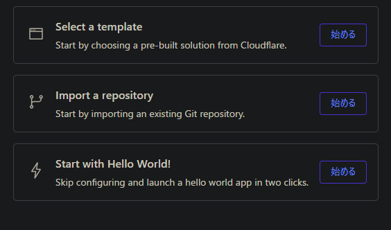

Oh, maybe “Import a repository” is the right choice!

And that is **game over**.

## Workers and Pages are far too easy to confuse

The reason is at the top of the screen.

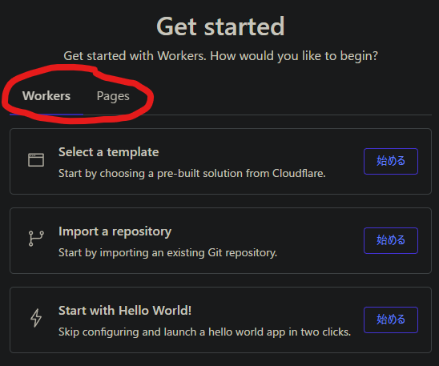

Unbelievably, you need to **switch tabs**.

I deliberately directed your attention toward it in this article, but honestly, I did not notice it myself.

If you miss this, the interface gradually starts looking stranger and stranger. Let’s continue anyway.

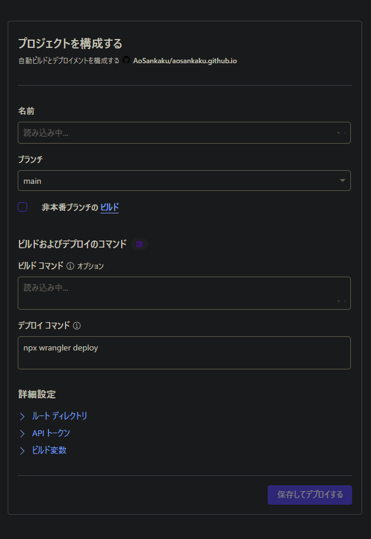

It smoothly takes us straight to the project configuration screen. Choose a random name, save it, and try deploying it.

Incidentally, Gatsby and Cloudflare Pages do not work particularly well together, according to my own research, so there is a chance it will fail anyway.

However, failing to install Yarn is far too serious. Let’s do something about it.

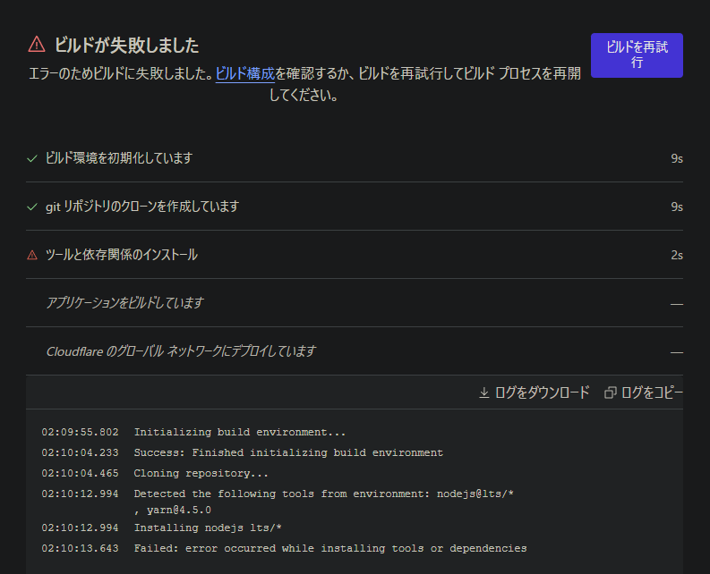

Let’s check this thing called the build configuration.

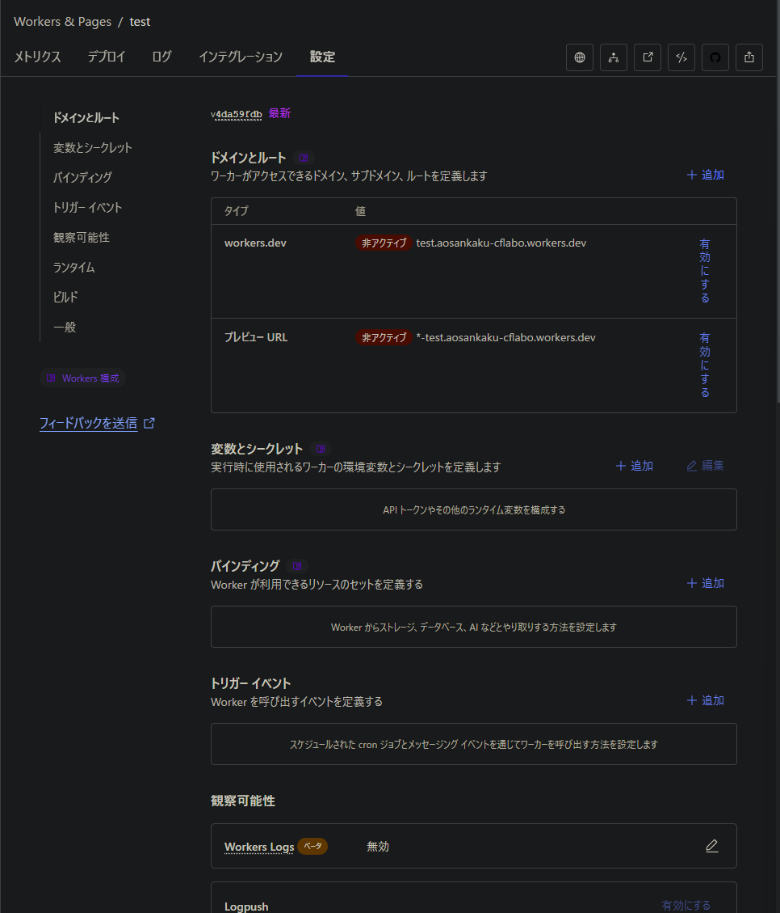

Let’s add an environment variable and deploy again.

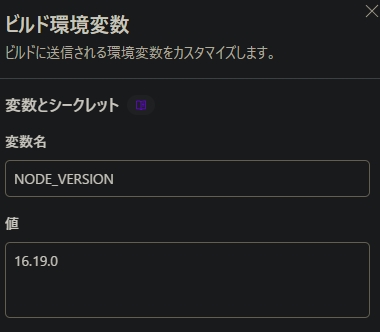

Now let’s try building it.

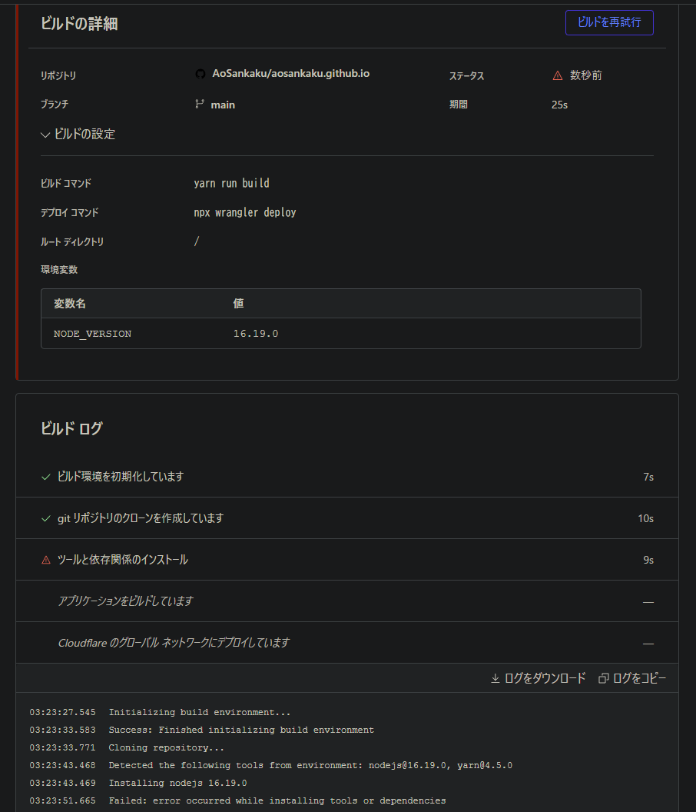

The same error stopped us again.

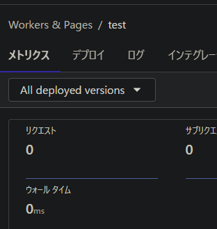

At this point, I could not make any further progress. No matter how many times I opened the preview URL, all I saw was `Hello world`.

Worse, the top-left corner looks like this, so you do not realize that you accidentally selected Workers instead of Pages.

Malicious.

## Let’s try Pages instead

So far, we have been doing it the wrong way: using **Workers** for an SSG.

Let’s now use the correct option, **Pages**.

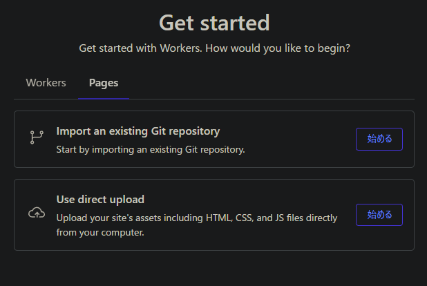

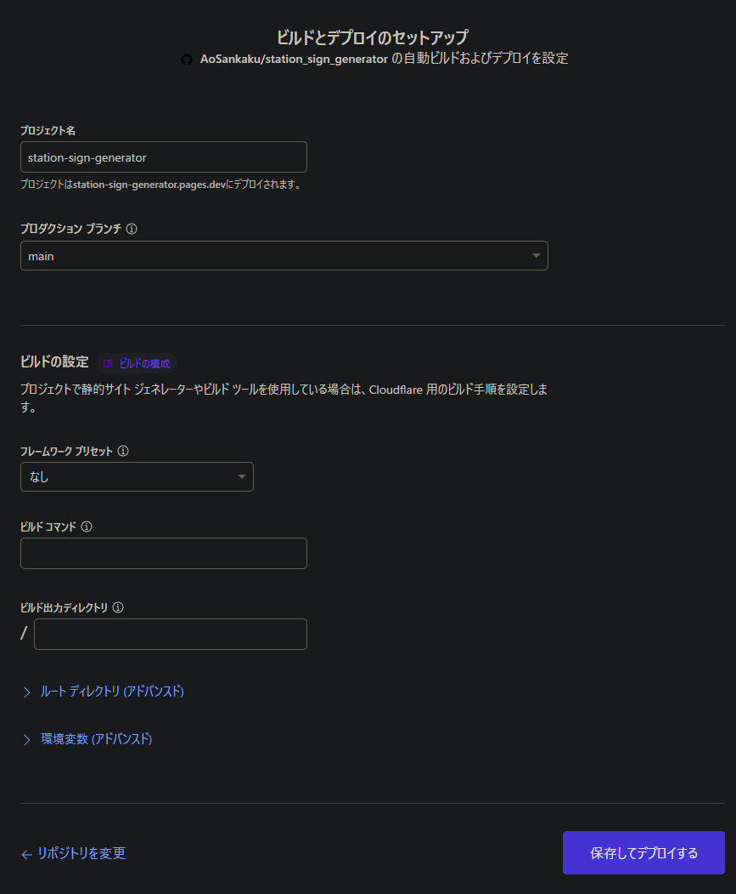

Well, well. This screen looks **completely different from the previous one**.

Of course it does. I wish these two had not been grouped together in the same place.

You need to change `NODE_VERSION`. Otherwise, it tries to build using some mysterious default value and fails.

Just set it to a reasonable version. Here, I used `20.11.1`, the same version installed on my computer.

At this point, I accidentally tried to build a different repository. During that attempt, I discovered that unless `YARN_VERSION` is explicitly set to `1`, it suddenly starts using version 3. That scared me quite a bit.

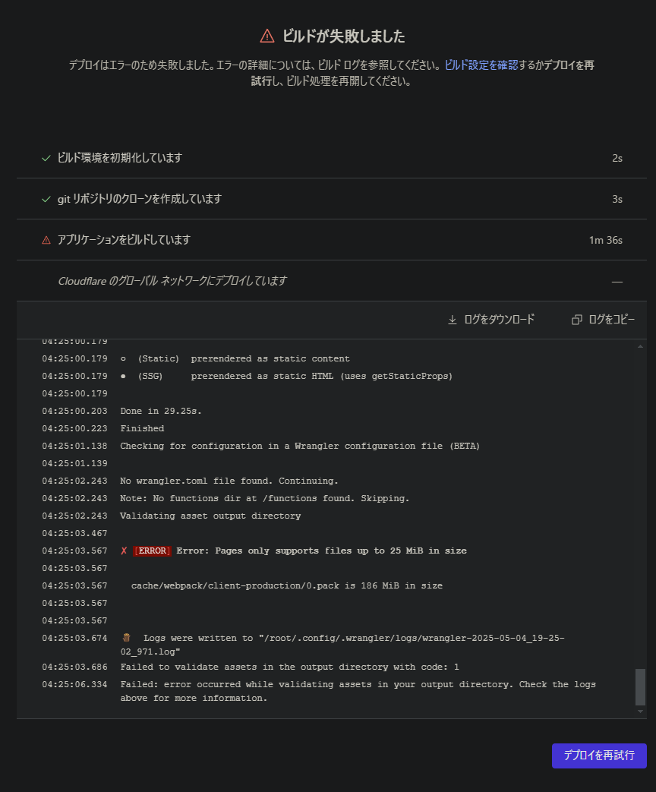

The build failed, but that was because one of my files was larger than 25 MB, so the cause was on my side. I think it is fair to call this a success.

I was also able to deploy another random project using Next.js Static Export with this setup.

---

That final failure weakened the persuasiveness of the article somewhat, but as long as you watch out for the tab-design trap and correctly set `NODE_VERSION`, things should mostly work out.

Good luck with development.
