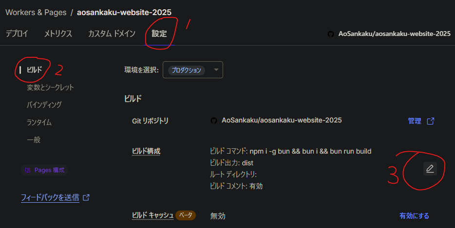
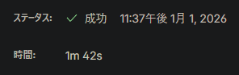
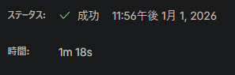

> [!NOTE]
> This article was initially translated with GPT-5.6 and then reviewed and edited by the author.

## Conclusion

To build with Bun, this command is not enough:

```bash
bun run build
```

Use this instead:

```bash
npm install -g bun && bun install && bun run build
```



This is where you put it.

## What I wanted to do

I recently learned that:

```bash
bun patch
```

lets you edit packages inside `node_modules`. I think you can do the same thing with npm or Yarn.

> [!TIP]
> To learn more about `bun patch`, you could read [this article](https://zenn.dev/koutyuke/articles/bun-patch-example) or something.

However, although the patch worked properly in local builds and the development environment, it did not work on Cloudflare Pages. That was strange.

So I checked the logs:

```ansi
23:36:03.477	Cloning repository...
23:36:06.576	From https://github.com/AoSankaku/aosankaku-website-2025
23:36:06.576	 * branch            f6c417a0565109496eba7f527d4fb56d27a20a50 -> FETCH_HEAD
23:36:06.576	
23:36:06.862	HEAD is now at f6c417a Repatched @astro-community/astro-embed-youtube prefetch
23:36:06.862	
23:36:06.932	
23:36:06.932	Using v2 root directory strategy
23:36:06.952	Success: Finished cloning repository files
23:36:08.787	Checking for configuration in a Wrangler configuration file (BETA)
23:36:08.787	
23:36:09.887	No wrangler.toml file found. Continuing.
23:36:09.951	Detected the following tools from environment: npm@10.9.2, nodejs@22.16.0
23:36:09.952	Installing project dependencies: npm install --progress=false
23:36:43.266	npm warn deprecated whatwg-encoding@3.1.1: Use @exodus/bytes instead for a more spec-conformant and faster implementation
23:36:48.708	
23:36:48.709	added 580 packages, and audited 581 packages in 38s
23:36:48.709	
23:36:48.709	196 packages are looking for funding
23:36:48.709	  run `npm fund` for details
23:36:48.710	
23:36:48.710	found 0 vulnerabilities
23:36:48.736	Executing user command: bun run build
23:36:48.958	$ astro build
23:36:51.468	14:36:51 [content] Syncing content
…
```

It very clearly says `npm@10.9.2`.

In other words, I had convinced myself that Bun was being used throughout the entire process when it actually was not. Scary.

After that, all I had to do was change the command as described at the beginning of the article.

## Bonus

As an added benefit, the build—or, more precisely, the package download—became a little faster.

Thirty seconds is a pretty big difference.

Before switching to Bun:



After switching to Bun:



## References

https://dt.in.th/BunCloudflarePages
