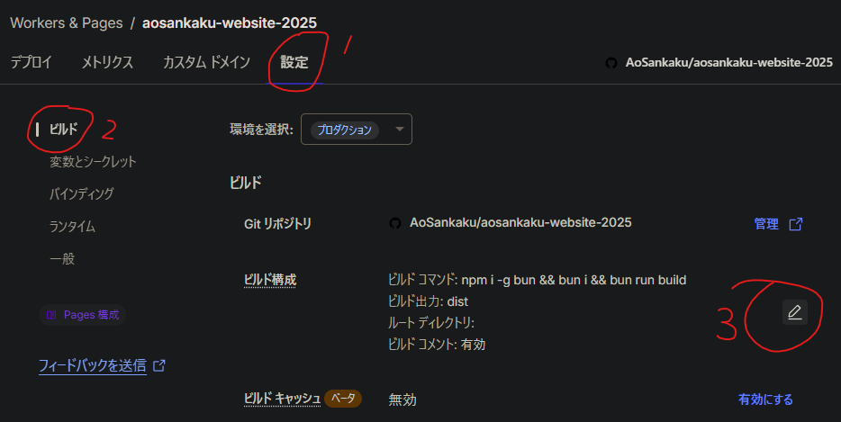

## 結論

bunでビルドするためのコマンドは、

```bash
bun run build
```

では不十分です。

```bash
npm install -g bun && bun install && bun run build
```

にしてください。



場所はここです。

## やりたかったこと

```bash
bun patch
```

で、`node_modules`に入っているパッケージを編集できるようになるということを最近学びました。npmやyarnでも同じ事はできると思います。

> [!TIP]
> `bun patch`についてもっと知りたい人は、[これ](https://zenn.dev/koutyuke/articles/bun-patch-example)とか読むといいんじゃないかな

しかし、当てたパッチがローカルのビルドや開発環境だとちゃんと動いているのにCloudflare Pagesで動かない…これはおかしい。

というわけでログを見てみると、

```ansi
23:36:03.477	Cloning repository...
23:36:06.576	From https://github.com/AoSankaku/aosankaku-website-2025
23:36:06.576	 * branch            f6c417a0565109496eba7f527d4fb56d27a20a50 -> FETCH_HEAD
23:36:06.576	
23:36:06.862	HEAD is now at f6c417a Repatched @astro-community/astro-embed-youtube prefetch
23:36:06.862	
23:36:06.932	
23:36:06.932	Using v2 root directory strategy
23:36:06.952	Success: Finished cloning repository files
23:36:08.787	Checking for configuration in a Wrangler configuration file (BETA)
23:36:08.787	
23:36:09.887	No wrangler.toml file found. Continuing.
23:36:09.951	Detected the following tools from environment: npm@10.9.2, nodejs@22.16.0
23:36:09.952	Installing project dependencies: npm install --progress=false
23:36:43.266	npm warn deprecated whatwg-encoding@3.1.1: Use @exodus/bytes instead for a more spec-conformant and faster implementation
23:36:48.708	
23:36:48.709	added 580 packages, and audited 581 packages in 38s
23:36:48.709	
23:36:48.709	196 packages are looking for funding
23:36:48.709	  run `npm fund` for details
23:36:48.710	
23:36:48.710	found 0 vulnerabilities
23:36:48.736	Executing user command: bun run build
23:36:48.958	$ astro build
23:36:51.468	14:36:51 [content] Syncing content
…
```

思いっきり`npm@10.9.2`って書いてあります。つまり、私はbunをすべての過程に使っていると思いこんでいたわけです。こわいねえ。

あとは記事の冒頭に書いてあるとおりに修正するだけです。

## おまけ

ついでにちょっとビルド（厳密に言うとパッケージのダウンロード）が速くなりました。30秒ってでかいよな。

移行前：


移行後：


## 参考文献

https://dt.in.th/BunCloudflarePages