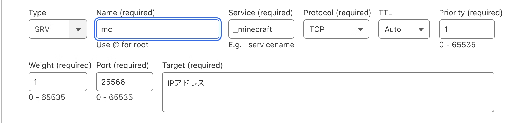
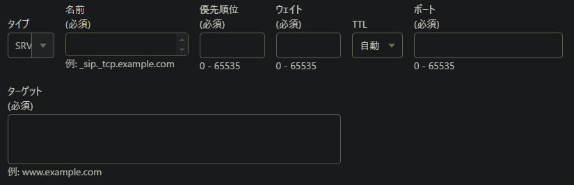

> [!NOTE]
> This article was initially translated with GPT-5.6 and then reviewed and edited by the author.

Have you ever thought, “I want to run multiple Minecraft servers on my home server!”?

Probably not.

Still, whether it is a home server or not, there are situations where you may want to run multiple Minecraft servers on the same machine. Changing the port number solves the problem, but making players enter a port number not only creates more opportunities for mistakes, it also looks vaguely uncool.

That is where an **SRV record** comes in handy. Let’s look it up.

## Goal

* Players can connect to Minecraft server 1 through the `mcfirst.example.com` subdomain.
* Players can connect to Minecraft server 2 through the `mcsecond.example.com` subdomain.
* Both servers run on the same physical machine but use different ports.
* Players can join without having to think about port numbers.

## What you find online

https://qiita.com/mono0218/items/9ac836728f218f61c573

This was the first article I found. It explains how the author successfully connected through a subdomain using an SRV record.

It also shows an image like this:



Source: https://qiita.com/mono0218/items/9ac836728f218f61c573

I thought, “So this is how I do it! All right, time to configure it!” and headed over to Cloudflare.

Then this screen appeared.



> ?????
> ????????
> ?????
>
> —Me, composing an internal haiku

## Solution

The format is just slightly different. Once you understand it, it is easy.

In the first screen, the settings are:

* Service: **_minecraft**
* Protocol: **TCP**
* Name: **mc**

To configure the same thing in Cloudflare’s interface, enter the following into the required Name field:

```text
_minecraft._tcp.mc
```

Naturally, replace `example.com` with your own domain.

The Target field is also important. An SRV target should be a hostname rather than a raw IP address. You can create an A record that points to the server’s IP address, then configure the SRV record to target that hostname and route players to the appropriate port.

## Solved!

As long as you remember this method, you can host as many servers for the same game as you like on the same machine.

Wonderful!

## Aside

I honestly did not understand what the “service name,” which is `_minecraft` in this case, actually meant. Does the game check it?

So I did a little research.

https://serverfault.com/questions/1098283/what-are-valid-zone-name-or-valid-service-name-for-srv-records

https://en.wikipedia.org/wiki/SRV_record

It is described as the **symbolic name of the desired service**.

Does that mean it merely says, “This record is for this service,” and that using the wrong value might not cause any actual problems?

Maybe.

https://www.reddit.com/r/dns/comments/kfouin/what_does_the_symbolic_name_or_service_name_in_an/

https://it-notes.stylemap.co.jp/webservice/srv%E3%83%AC%E3%82%B3%E3%83%BC%E3%83%89%E5%AE%8C%E5%85%A8%E3%82%AC%E3%82%A4%E3%83%89%E3%80%80%E5%9F%BA%E6%9C%AC%E3%81%8B%E3%82%89%E5%AE%9F%E8%B7%B5%E3%81%BE%E3%81%A7%E3%81%AE%E6%B4%BB%E7%94%A8/

On the other hand, I also found several sources saying that choosing an arbitrary value can cause problems.

But if Minecraft Java Edition uses `_minecraft`, what should a Bedrock Edition server use?

Anyone with some free time may want to experiment.
