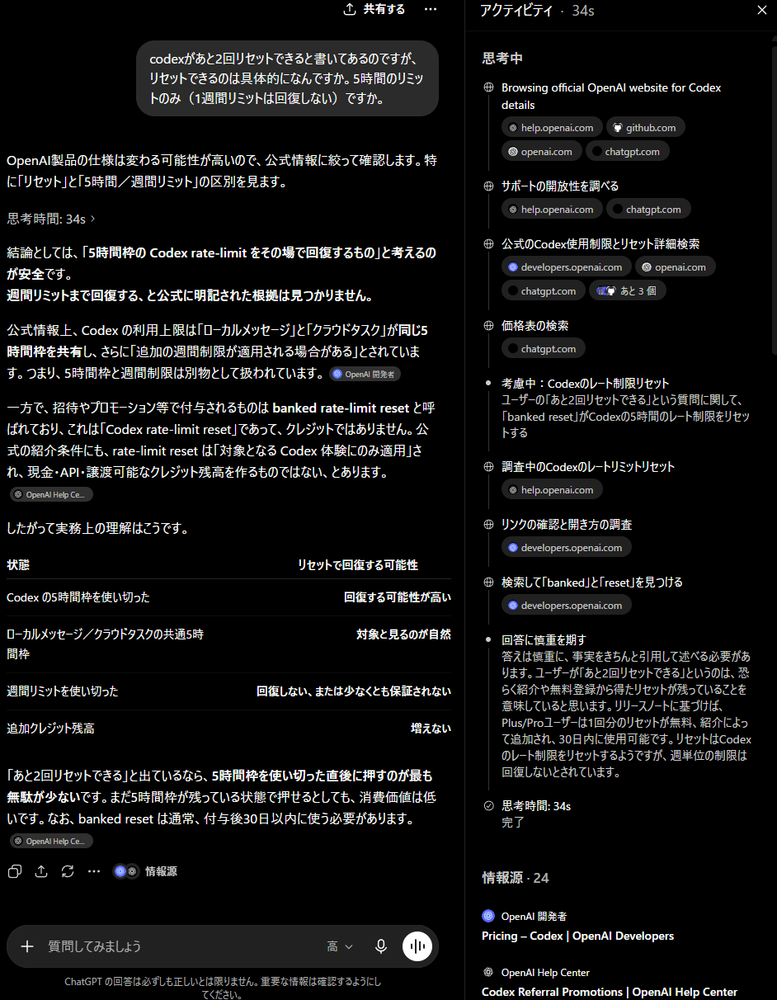

> [!NOTE] 手抜き注意
> この記事は速報なので手抜きです。

普通に損したので共有します。Codexの「◯回リセット可能」で溜めておけるアレは、週間と5時間の**両方のリミットをリセットします**。使い所さんに気をつけよう！

アンなんとか社と比べてかなり良心的な枠で有名なCodexですが、リセットも太っ腹仕様だったようです。シンプルに嬉しいね。

## リセット直後の風景

両方リセットされてら。やったー。うれぴー。じゃないんだよね。オイ。

## ChatGPTにも嘘をつかれた

嘘をつくな！！！！！！！！！！！！！！！！！！！！！！！

### だって公式サイトに書いてないもんね

https://help.openai.com/ja-jp/articles/11369540-using-codex-with-your-chatgpt-plan

https://developers.openai.com/codex/pricing#what-happens-when-you-hit-usage-limits

どっちにも書いてません。説明する気あんのかな。

## 英語情報ならある

https://www.reddit.com/r/codex/comments/1u42cth/does_the_codex_referral_banked_reset_reset_weekly/

Redditにありました。英語で調べればよかった。俺はAIスロップばかりになったnoteを見るのが悲しい。AI周りのnoteの記事、どうしてあんなにゴミしかないんだろう。

---

皆さんはAI回答とAIスロップnoteに騙されないようにしてください。Redditって掲示板みたいなもんだから信用できないかと思ったけど、AIスロップよりはRedditのほうが信用できると思います。

それでは、ハッピーバイヴコーディング。