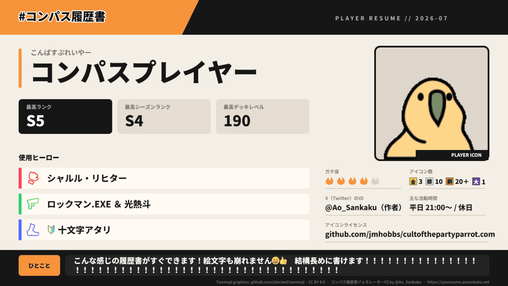
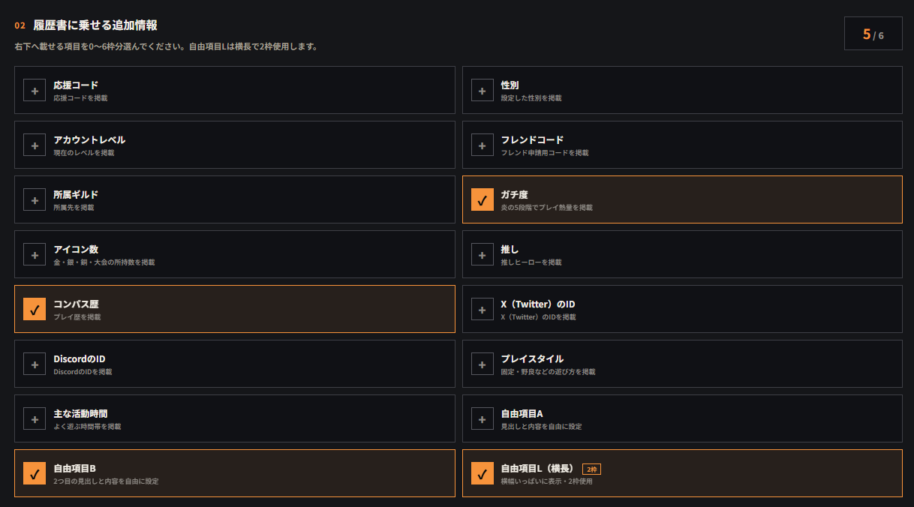

かつて公開していたコンパス履歴書ジェネレーターを復活させたので、記事にしてもう一度宣伝します。使ってくださっていた方は、本当に長らくおまたせしました。

## 「#コンパス履歴書ジェネレーター」ってなんだよ

#コンパスには [#コンパス履歴書](https://twitter.com/search?q=%23%E3%82%B3%E3%83%B3%E3%83%91%E3%82%B9%E5%B1%A5%E6%AD%B4%E6%9B%B8&src=typed_query) なる文化があるのですが、スマホで画像加工するのが面倒くさすぎて気がついたら衝動的に作っていました。これがもう7年前のことです。時間がすぎるのって早いね。

もちろん非公式なので、相変わらずずっと使える可能性は低いです。ごめんね。

## リンク

ここから作成できます。

https://cpsresume.aosankaku.net

こちらから作成できます。3分ぐらいで完成します。  

## サンプル

旧バージョンよりデザインが（AIスロップ感は満載なものの）だいぶマシになり、ついでにGIFに対応しました。普通に過剰機能かもしれないけど、おもろいからヨシ！

入力項目が多彩に選べるようになりました。「テンプレあるけど全部埋めるのだるい！！！」みたいな人でも使える親切設計です。

- 応援コード
- アカウントレベル
- フレンドコード
- 所属ギルド
- ガチ度
- コンパス歴
- アイコン数
- 各種SNSのID
- 自由項目（上限2）
- 横長の自由項目

など、結構多彩に選べます。ガチ初心者から超上級者まで、幅広く使ってもらえるようなデザインになりました。アイコン数のデザインが目立ちにくいのはちょっとなんとかしたいと思っているので、アイデアがある人は連絡ください。

---

## なぜ旧ジェネレーターが死んでいたのか

ここからはお気持ち表明釈明タイムです。

2年前ぐらいに`aosankaku.net`を購入したのですが、その時メインサイトのURLも`aosankaku.github.io`から`aosankaku.net`に移行していました。どうやら、これが理由でその他の`aosankaku.github.io`を含むサイト・ツールすべてが爆発していたみたいです。細かい理屈はわかりませんが、そういうことです。

「どうせ再公開するならいい感じ™にしたいな～」と思いつつ、コード負債が重かったり他に作りたいものがあったりして、先延ばし先延ばしになっていました。ところが、彗星のごとくCodex（ChatGPT）が出てきてずいぶんと状況が変わり、なんと **着手からわずか4日** での公開となりました。

できるだけスロップにならないように工夫したつもりですが、文句・不具合等があれば [直接言ってください](https://twitter.com/@Ao_Sankaku)。反AI教条主義者じゃなければ話は聞きます。

それと、あまり気にする人いないと思いますが`aosankaku.github.io`は`aosankaku.net`にリダイレクトするので、`aosankaku.github.io/cps_resume/`にアクセスした人は`aosankaku.net/cps_resume/`を通って現行URL`cpsresume.aosankaku.net`に到達できるようになっています。旧URLをばらまいても、共有時に説明文が出ないぐらいで支障はないのでご安心ください。

また色々作ります。よければ楽しみにしていてください。