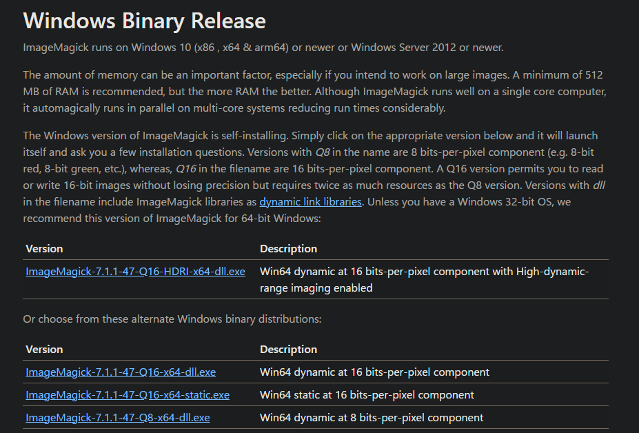
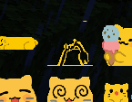
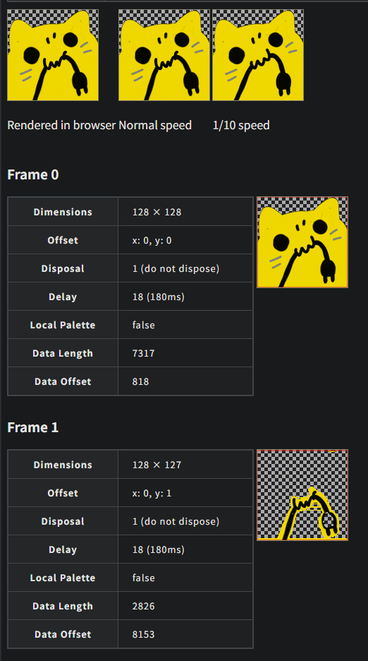
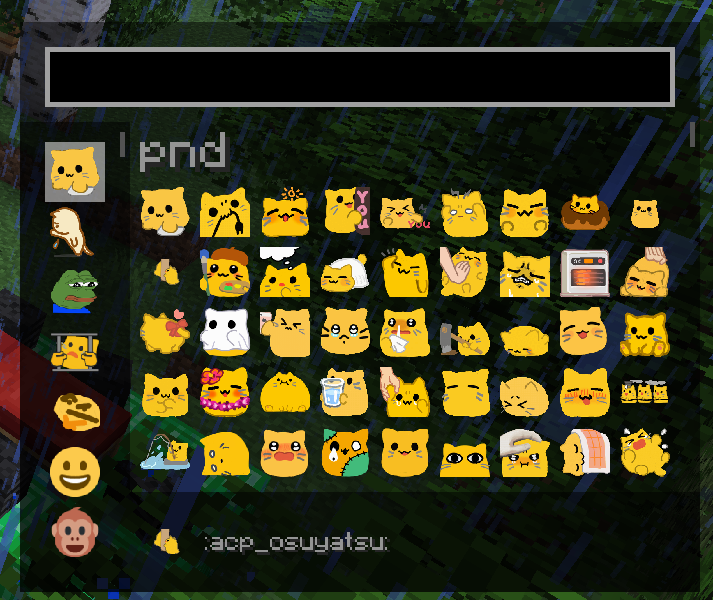
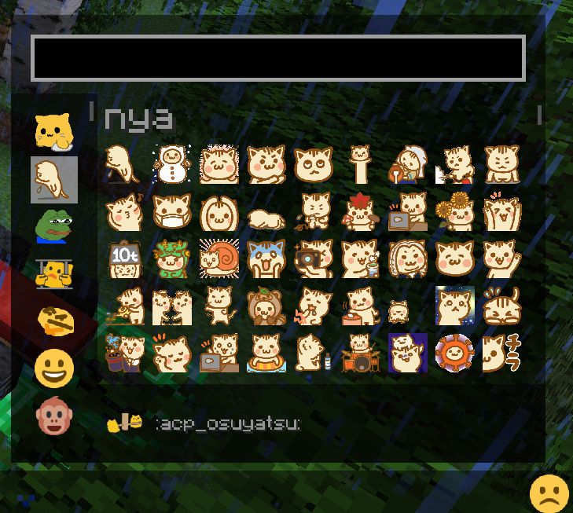

> [!NOTE]
> This article was initially translated with GPT-5.6 and then reviewed and edited by the author.

## Conclusion

Use ImageMagick.

https://imagemagick.org/index.php

The website has a distinctly old-fashioned atmosphere. Everything related to GIFs seems to be like this.

### Download

https://imagemagick.org/script/download.php

On Windows, scroll down to “Windows Binary Release.”



Download an appropriate `.exe` file. It uses a normal installer.

## How this started: Images break in Emojiful

There is a Minecraft mod called **Emojiful**.

https://modrinth.com/mod/emojiful

As the name suggests, it is a mod that lets you display emojis. However, GIFs occasionally break.



As you can see, **part of the image becomes transparent**. Strange.

There is also a problem where horizontally long emojis get stretched. Because of that, I needed to resize the images to a 1:1 aspect ratio and solve this problem.

### Sharp automatically optimizes GIFs when resizing them

One well-known image-processing library for Node.js is Sharp.

https://sharp.pixelplumbing.com

I used it to put together a script that resizes every image in a folder. Writing it was annoying, so I made AI—Gemini—write all of the code.

```js
// Save this file with the .mjs extension so that it runs as an ES module.
// Alternatively, add "type": "module" to package.json.

import fs from 'fs/promises';
import path from 'path';
import sharp from 'sharp';

/**
 * Processes GIF and PNG images inside the specified directory.
 *
 * - Images that already have a 1:1 aspect ratio and are no larger than
 *   128px by 128px are copied directly to the output folder.
 * - All other images are resized to a 1:1 aspect ratio of 128px by 128px.
 * - During resizing, the image is aligned to the bottom, with transparent
 *   padding added above it and, where necessary, to the left and right.
 * - GIF animation is preserved.
 *
 * @param {string} inputDir - Path to the input directory to process.
 */
async function processImages(inputDir) {
  // The output directory is created as a subfolder of the input directory.
  const outputDir = path.join(inputDir, 'output_resized');
  const targetSize = 128; // Target size after resizing, such as 128px by 128px.

  try {
    // Check whether the input directory exists.
    const stats = await fs.stat(inputDir);
    if (!stats.isDirectory()) {
      console.error(`Error: The specified path "${inputDir}" is not a directory.`);
      return;
    }

    // Create the output directory if it does not exist.
    await fs.mkdir(outputDir, { recursive: true });
    console.log(`Created output directory: "${outputDir}".`);

    // Read every file inside the input directory.
    const files = await fs.readdir(inputDir);
    console.log(`Found ${files.length} files in "${inputDir}".`);

    // Process each file in parallel.
    await Promise.all(files.map(async (file) => {
      const filePath = path.join(inputDir, file);
      const ext = path.extname(file).toLowerCase();
      const fileNameWithoutExt = path.basename(file, ext);
      const outputPath = path.join(outputDir, `${fileNameWithoutExt}${ext}`);

      try {
        const fileStats = await fs.stat(filePath);

        // Skip directories and files that have already been resized.
        if (fileStats.isDirectory() || file.endsWith('_resized' + ext)) {
          console.log(`Skipped "${file}" because it is a directory or an existing resized file.`);
          return;
        }
      } catch (statError) {
        console.warn(`Could not inspect "${file}". Skipping it. Error: ${statError.message}`);
        return;
      }

      // Check whether the file is a GIF or PNG.
      if (ext !== '.gif' && ext !== '.png') {
        console.log(`Skipped "${file}" because its format is not supported.`);
        return;
      }

      try {
        console.log(`Processing "${file}"...`);

        let imageProcessor;

        // For GIF images, load them with the animated option enabled.
        if (ext === '.gif') {
          imageProcessor = sharp(filePath, { animated: true });
        } else {
          imageProcessor = sharp(filePath);
        }

        // Read image metadata such as width and height.
        const metadata = await imageProcessor.metadata();
        const { width, height } = metadata;

        // Skip the file if its metadata cannot be read.
        if (!width || !height) {
          console.warn(`Could not read metadata from "${file}". Skipping it.`);
          return;
        }

        const maxOriginalDim = Math.max(width, height);

        // If the image already has a 1:1 aspect ratio and its longest side
        // is no larger than targetSize, copy it without resizing or padding.
        if (width === height && maxOriginalDim <= targetSize) {
          await fs.copyFile(filePath, outputPath);
          console.log(
            `"${file}" already has a 1:1 aspect ratio and is no larger than ` +
            `${targetSize}px, so it was copied directly to "${outputPath}".`
          );
          return;
        }

        // Resize every other image:
        // - A 1:1 image larger than targetSize, such as 200x200, is reduced to 128x128.
        // - A non-square image, such as 200x100 or 50x100, is fitted into a
        //   transparent 128x128 canvas while preserving its aspect ratio.
        imageProcessor = imageProcessor.resize(targetSize, targetSize, {
          fit: sharp.fit.contain,
          position: sharp.strategy.south,
          background: { r: 0, g: 0, b: 0, alpha: 0 }
        });

        // Save the resized image.
        // For GIF images, preserve the animation.
        if (ext === '.gif') {
          await imageProcessor.gif({ animated: true }).toFile(outputPath);
        } else {
          await imageProcessor.toFile(outputPath);
        }

        console.log(`Successfully resized "${file}" to "${outputPath}".`);
      } catch (error) {
        console.error(`An error occurred while processing "${file}":`, error);
      }
    }));

    console.log("Finished processing all images.");
  } catch (error) {
    console.error("An error occurred while running the script:", error);
  }
}

// Read the input directory from the command-line arguments.
// process.argv[0] is "node", and process.argv[1] is the script filename.
const args = process.argv.slice(2);
const inputDirectory = args[0] || './';

// Run the script.
processImages(inputDirectory);
```

For Node.js beginners: before running the script, you need to execute something like `npm i sharp` or `yarn add sharp`.

However, the result was that even more images started developing the transparent areas described earlier.

Why?

https://movableink.github.io/gif-inspector/

I suddenly had an idea and used this site to inspect one of the broken GIFs.



Now, let’s look at the broken image again.


**This is absolutely the cause.**

After looking into it, I learned that modern GIFs commonly save space by storing and rendering only the differences between frames.

I assumed this was causing the Emojiful bug, so I started looking for a way to perform the opposite process: **deoptimization**.

## How do you deoptimize a GIF?

There is plenty of information about “GIF optimization” and “reducing GIF file size.”

However, apparently very few people search for strange phrases like “GIF deoptimization” or “generate complete GIF frames.” I could barely find any information. Not even in English.

It also appeared that Sharp had no feature for fully rendering every GIF frame. Apparently, this is caused by the behavior of a library that Sharp depends on. Since it is hardcoded, there did not seem to be any way to disable it from our side.

### I interrogated Gemini

So I interrogated the AI, and what it eventually gave me was **ImageMagick**.

https://imagemagick.org/index.php

ImageMagick has an option that forces every frame to be fully rendered. Apparently, this does exactly what we need.

```bash
magick convert taifu-nya.gif -coalesce output-taifu-nya.gif
```

Just add the `-coalesce` option like this, and the job is done.

Happily ever after.

### Batch conversion

Here is a batch-conversion script as well. This one is for Windows PowerShell.

```ps1
# Create the "deoptimized" folder if it does not already exist.
$deoptimizedPath = Join-Path (Get-Location) "deoptimized"
If (-not (Test-Path $deoptimizedPath)) {
    New-Item -Path $deoptimizedPath -ItemType Directory
}

Get-ChildItem -Filter "*.gif" | ForEach-Object {
    magick $_.FullName -coalesce (Join-Path $deoptimizedPath $_.Name)
}

pause
```

When you run it, the deoptimized GIFs will be placed in a directory named `deoptimized`.

Put those into Emojiful, and you are done.



It no longer breaks. Yay.



I also added a cat emoji.

## About the emoji images

The emoji images can be downloaded from the following websites. Copyright belongs to their respective creators.

### pnd series: Yellow cat emojis

https://kasakoso.lol/@admin/pages/1692410352359

### Nekochan emojis

https://note.com/shikamatsu/n/nd217dc0617db
