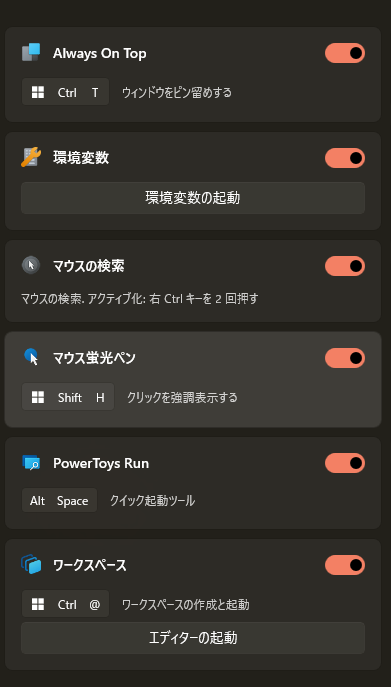

> [!NOTE]
> This article was initially translated with GPT-5.6 and then reviewed and edited by the author.

## Cause

The cause is **Microsoft PowerToys**.

By default, this happens when you **press Ctrl twice**. It is not something you would deliberately do without knowing about the feature, but accidentally pressing Ctrl twice and suddenly seeing the screen go dark is probably fairly common.

I do not know whether this comes enabled as an extra when you activate some other feature, or whether it is enabled by default for everyone.

## How to disable it

Even if you leave it alone, all it does is make the area around the mouse pointer bright while dimming everything else, so it is not particularly harmful. Still, accidentally pressing Ctrl twice happens easily enough, so let’s change the setting.

Press the Windows key, type `powertoys`, and press Enter. You should find this feature on the first screen.

If you do not use it, simply disable it. That is all.

## How to change the shortcut

That said, this is not a feature that is **completely and absolutely useless**.

If you have a large monitor or multiple monitors, losing track of the mouse pointer is perfectly normal.

You can change it immediately under “Activation method.” Easy.

There is also an option called “Custom shortcut,” so assign it to whatever key combination you prefer.
