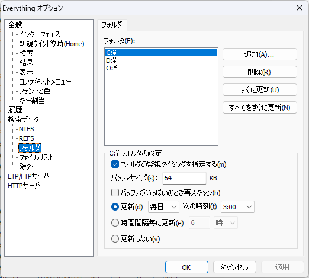
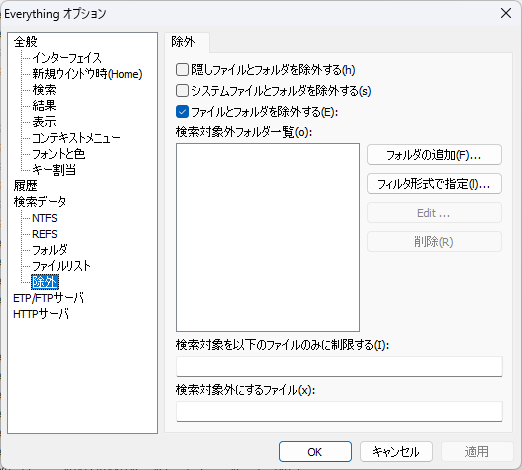

Everything、便利ですよね。

https://forest.watch.impress.co.jp/library/software/everything/

でも思わぬ見落としで目的のファイルが見つからないときもあります。項目はそう多くありません、確認してみてください。

## ちゃんとフォルダを指定しているか？

設定から、ちゃんとフォルダを指定できているか見てみましょう。ここが抜けていること、割とあります。

もしも抜けていた場合は、ここから「再構築する」をしてやりましょう。

## 除外していないか

隠しファイル、フォルダ、または検索対象外フォルダー一覧に「C:/」とか入っていたらだいぶ検索しづらくなってしまいます。注意しましょう。

ここを更新したあとは「再構築する」をしたほうがいいと思います。勘ですけど。

## それでも出ないときは

Everythingは、**フィルターが原因で検索に引っかかっていない場合でも警告を出しません**。「全て」にしないと目的のものが出てこないパターンも多く存在します。

正規表現を知らないのに「正規表現で検索」がONになっていたり、完全一致していないのに完全一致がONになっていても同様です。意外と見落としがちなので気をつけてね。