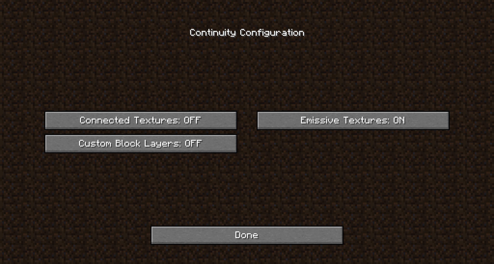

> [!NOTE]
> This article was initially translated with GPT-5.6 and then reviewed and edited by the author.

This is not particularly a Minecraft blog, but I could barely find any information about this, even in English, so I decided to write an article about it.

As the title says, the goal is to make ores glow while using Fabric and Sodium.

## Prerequisite: What is Sodium?

### Features of Sodium

Sodium is a performance optimization mod that offers better performance than OptiFine. There is no Forge version, and it only runs on Fabric.

It is famous for improving FPS by around **three to five times** compared with vanilla Minecraft, while also delivering better performance than OptiFine.

Even the famous OptiFine can improve FPS by two to three times, so Sodium outperforming it is rather terrifying.

Also, while OptiFine can only be downloaded from its own website, Sodium is conveniently available from ordinary mod-distribution sites such as CurseForge and [Modrinth](https://modrinth.com/mod/sodium/versions).

https://modrinth.com/mod/sodium/versions

### Downsides of Sodium

However, it does have a few downsides.

* **There is no Forge version**

  There are probably [no plans to develop one in the future either](https://github.com/CaffeineMC/caffeine-meta/wiki/FAQ#where-are-the-forge-versions-of-your-mods).

  https://github.com/CaffeineMC/caffeine-meta/wiki/FAQ#where-are-the-forge-versions-of-your-mods

* **It only supports Minecraft 1.16.1 and later**

  On CurseForge, the oldest available version is for 1.16.1. Fabric itself only supports Minecraft 1.14 and later anyway, so naturally, you cannot use older Forge mods with it.

* **It does not include OptiFine's extra features**

  Installing OptiFine by itself gives you access to features such as:

  1. Shader-pack support
  2. Connected textures for glass and similar blocks
  3. **Emissive textures that make ores glow**

  Sodium contains **only** performance optimization features. Installing Sodium alone does not provide any of the features listed above.

### You cannot install it alongside OptiFine

[OptiFine and Sodium are not compatible](https://www.reddit.com/r/Optifine/comments/hzk9yd/is_sodium_a_performance_enhancing_mod_compatible/). Be careful not to install both at the same time.

https://www.reddit.com/r/Optifine/comments/hzk9yd/is_sodium_a_performance_enhancing_mod_compatible/

## How to make ores glow

To get straight to the point, you need all of the following:

1. Fabric
2. Fabric API
3. Sodium
4. Indium
5. Continuity
6. Mod Menu, optional
7. An emissive ore resource pack

Let’s go through them in order.

### Installing Fabric, Fabric API, and Sodium

Google it.

I do not think anyone reading this article is unable to install Fabric API and Sodium.

### Installing Indium

Indium is an add-on, or extension, for Sodium. It supports rendering features that Sodium does not directly support.

However, because it is only an extension, **Sodium is still required**. Be careful, because Indium will not work without it.

You can download it from the [Indium page on Modrinth](https://modrinth.com/mod/indium/versions).

https://modrinth.com/mod/indium/versions

### Installing Continuity

Earlier, I wrote that Sodium does not include connected-texture support for glass and similar blocks. Continuity is a mod that provides that feature.

More importantly, however, this mod also supports **emissive textures that make ores glow**.

I discovered this while reading [an issue in Sodium's GitHub repository](https://github.com/CaffeineMC/sodium-fabric/issues/1370).

https://github.com/CaffeineMC/sodium-fabric/issues/1370

This mod **requires Indium**. In other words, Sodium is the prerequisite of the prerequisite.

You can download it from the [Continuity page on Modrinth](https://modrinth.com/mod/continuity/versions).

https://modrinth.com/mod/continuity/versions

### Installing Mod Menu, optional

You do not particularly need Mod Menu, but installing it lets you change settings such as disabling connected glass textures.

By default, the following features are all enabled:

* Connected textures for glass and bookshelves
* Emissive textures
* Custom block layers, whose effect I do not understand

### Installing an emissive ore resource pack

With OptiFine, you can install the resource pack immediately after installing OptiFine itself.

With Sodium, you need to install every mod listed above except Mod Menu before you are finally ready to use the resource pack.

Even if a resource pack says “OptiFine Required,” you do not need to install OptiFine. Just install the resource pack normally.

I use this one:

[New Emissive Ores on CurseForge](https://www.curseforge.com/minecraft/texture-packs/emissive-ores-1-17)

Other resource packs should also work without problems. Try a few and see what you like.

Do not forget to enable the resource pack.

https://modrinth.com/resourcepack/emissive-ores

#### What if Minecraft says it is incompatible?

You may see an incompatibility warning when using an older resource pack on a newer Minecraft version, or the other way around.

To get straight to the point, **you can ignore it**.

## Finished!

After completing all of these steps, your ores should be glowing properly.

Launch the game and check for yourself.

Loading may take a while, but that is normal behavior. I recommend playing some mobile game while you wait. My personal impression is that it feels fairly heavy.

Good work. Enjoy your Minecraft life!

## Update: April 3, 2024

This article gets far more views than anything else on this blog, so I improved it slightly by adding more information and making the links a little more presentable.

### For CurseForge users

This article primarily links to Modrinth rather than CurseForge.

I explained the reason in [this article](../sodium_got_back/).
