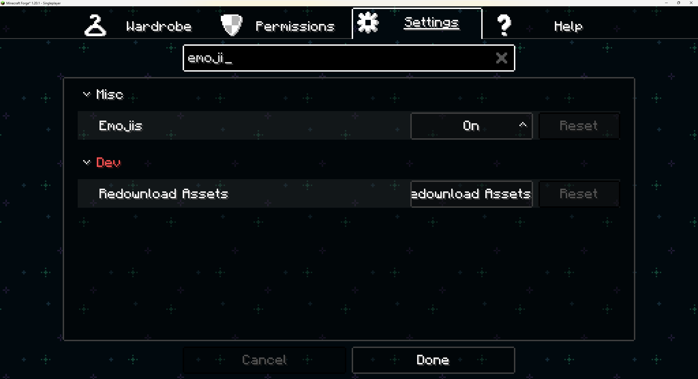
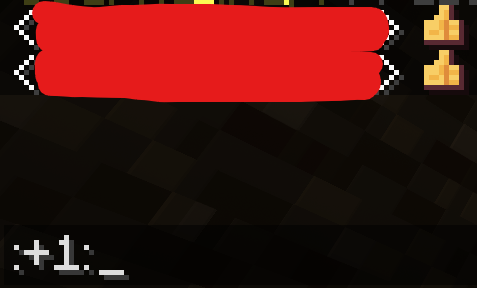

> [!NOTE]
> This article was initially translated with GPT-5.6 and then reviewed and edited by the author.

## What is Figura?

https://modrinth.com/mod/figura

It is this mod. It lets you add character animations and customize your skin.

Since it is a client-side mod, you do not need to install it on the server.

### It secretly adds emoji support...

When it comes to Minecraft mods that add emojis, **Emojiful** is probably the most famous one.

https://modrinth.com/mod/emojiful

Being able to use emojis in chat is surprisingly fun.

However, if emojis suddenly appear even though you have not installed Emojiful, that seems strange.

The culprit may be Figura.

When I searched the settings for “Emoji,” there it was.

The mod’s download page does not mention this feature at all.

Entering `:+1:` really does turn it into an emoji. The pixel-art style is cute.

It supports Tab-key autocomplete, but it does not seem to do much beyond that.

## Warning: It is incompatible with Embeddium

https://github.com/FiguraMC/Figura/issues/226

This issue is a little old, but Figura apparently is not compatible with Embeddium.

The emojis did not appear in a random mod setup I put together, which made me go, “Huh?”

Apparently, this was the reason.
