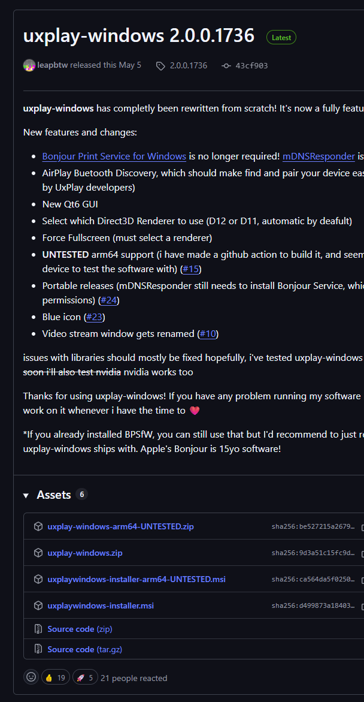
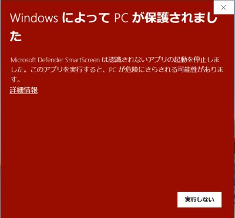
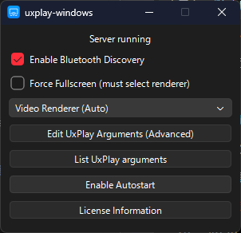
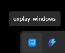
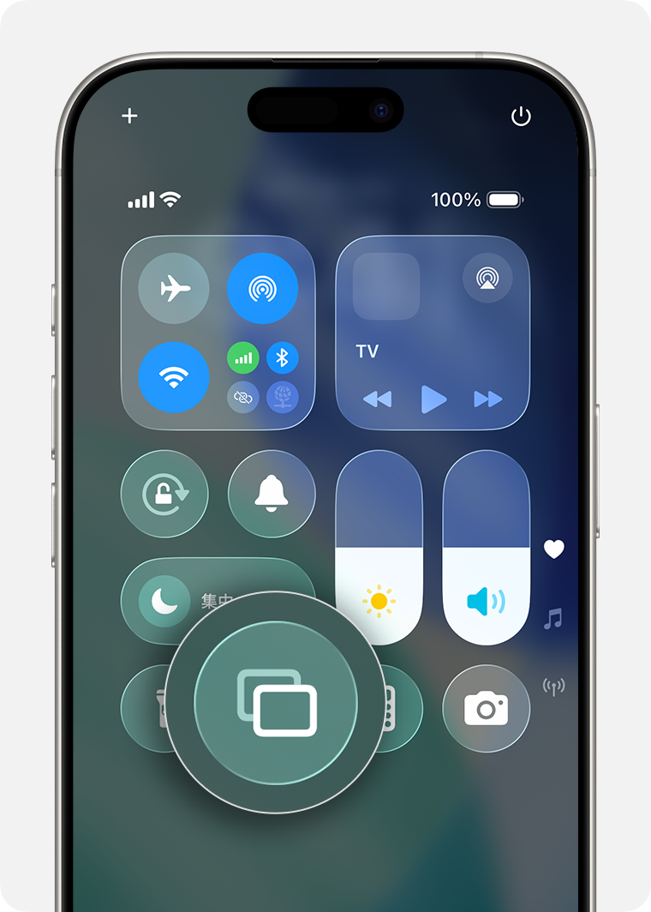

以前、このブログでUxPlayを紹介しました。しかし、インストール手順が14にも及ぶ上、ターミナル（黒い画面）を使う必要があるということで、とても実用的とは言えない内容でした。

そういうわけで、いつものチャッピーを問い詰めてみたら**uxplay-windows**なるものがあるということで、そっちを使ってみたところ腰を抜かすぐらい簡単だったので紹介します。

> [!IMPORTANT]
> WindowsとiPhone/iPadは、同じWi-Fi（厳密にはLAN）に繋いである必要があります。

## UxPlayとは？

さっき書いたとおりです。**自分で大量の手順を踏まないと使えない地獄のアプリ**です。中身自体はね、素晴らしいんですがね。

私を含め、到底一般人に使えるものじゃないので悩んでいました。

## uxplay-windowsとは？

**uxplay-windows**は、入れたら**すぐ使えます**。革命が起きますよこれ。

ダウンロード先はここにあります。

https://github.com/leapbtw/uxplay-windows/releases

英語なのでわかりにくいですが、ひとまずこの`uxplaywindows-installer.msi`を入れておけば大丈夫です。

> [!WARNING] 署名なし
> **署名はない**ので気をつけてください。どういうことかというと、例の赤い画面が出ます。「詳細情報」を押し、無視して続行してください。
>
> また、バージョンに気をつけてください。署名をちゃんとやっていないということは、**もしプロジェクトが乗っ取られていても気づけません**。
> 
> 
> 
> 引用元：https://arkouji.cocolog-nifty.com/blog/2021/06/post-70320d.html

### 起動しておく

起動すると、ちっこい画面が出ます。

Xを押しても、タスクトレイ（右下のV）に入ったままになるので続けて使用可能です。

### iPhone/iPadからAirPlayする

右上を下にスワイプして出てくる例の画面を出します。そこから、四角が2個重なったようなボタンを押します。

引用元：https://support.apple.com/ja-jp/102661

「uxplay-windows」があると思うので、それをタップすれば完了です。Windowsに映像と音が行っているはずです。超簡単。

Discordで画面共有がしたければ、uxplay-windowsの画面を配信すればいいだけです。

### Windows起動時に勝手に動くようにしたい場合

Enable Autostartを押してください。

ただし、もし同じWi-Fiを誰かと共有している場合、家族が間違っていきなりパソコンにイヤ～ンな動画を流す可能性も否定できないので、使うときだけONにすることをおすすめします。

---

UxPlay本家があまりに難しすぎるので「無理かな～」と思っていたのですが、想像よりもずっと行けそうで良かったですな。しかもこっちはほぼ遅延がないです。Appleって想像よりすごいね。

それでは、よいストリーミングライフを。