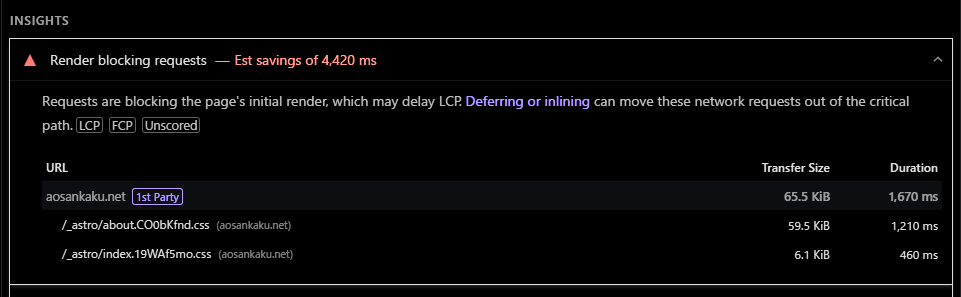
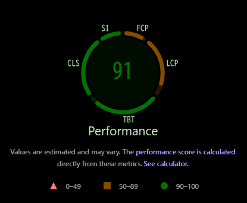

新年あけましておめでとうございます。Fontsource、お前は許さない。

## 概要

まあとりあえずこれ見てくださいよ。


> [!NOTE]
> Pagespeed Insightsの生データが見たい方は[こちら](https://pagespeed.web.dev/analysis/https-aosankaku-net/dylm2iepd3?form_factor=mobile)から見れます。

これはうちのサイトのパフォーマンススコアです。前までは100近かったと思うのですが、ある時を境に急落してしまいました。

どうしてAstroでSSGしててこんなに？と思いつつ見ていくと、クソデカCSSがありました。



`about.css`やそれに類するものを作った記憶はありません。ボブは訝しんだ。

中身はこんなのになっていました。元データはMinifyされていて1行になっており読みづらかったので、可能な範囲で読みやすくしています。

```css
header[data-astro-cid-3ef6ksr2].header-container {
  display: flex;
  justify-content: space-between
}
div[data-astro-cid-3ef6ksr2].left {
  display: flex;
  flex-direction: row;
  justify-content: flex-start;
  align-items: center;
  gap: 7px;
  padding: 5px 10px
}
div[data-astro-cid-3ef6ksr2].right {
  display: flex;
  flex-direction: row;
  justify-content: flex-end;
  align-items: center;
  gap: 7px;
  padding: 5px 10px}button[data-astro-cid-3ef6ksr2]{padding: 0;
  display: flex;
  align-items: center}span[data-astro-cid-3ef6ksr2]{position: absolute;
  width: 1px;
  height: 1px;
  padding: 0;
  margin: -1px;
  overflow: hidden;
  clip: rect(0,0,0,0);
  white-space: nowrap;
  border-width: 0
}
a[data-astro-cid-3ef6ksr2] {
  color: var(--color-text);
  text-decoration: none;
  display: flex;
  align-items: center
}
#themeToggle[data-astro-cid-3ef6ksr2]{
  border: 0;
  background: none;
  cursor: pointer
}
.sun[data-astro-cid-3ef6ksr2]{
  color: #000;
  display: none
}
.moon[data-astro-cid-3ef6ksr2]{
  color: #000;
  display: block
}
.dark .sun[data-astro-cid-3ef6ksr2]{
  color: #fff;
  display: block
}
.dark .moon[data-astro-cid-3ef6ksr2]{
  display: none
}
@font-face{
  font-family: Noto Sans JP Variable;
  font-style: normal;
  font-display: swap;
  font-weight: 100 900;
  src: url(/_astro/noto-sans-jp-0-wght-normal.BEjcQAjL.woff2) format("woff2-variations");
  unicode-range: U+25ee8,U+25f23,U+25f5c,U+25fd4,U+25fe0,U+25ffb,U+2600c,U+26017,U+26060,U+260ed,U+26222,U+2626a,U+26270,U+26286,U+2634c,U+26402,U+2667e,U+266b0,U+2671d,U+268dd,U+268ea,U+26951,U+2696f,U+26999,U+269dd,U+26a1e,U+26a58,U+26a8c,U+26ab7,U+26aff,U+26c29,U+26c73,U+26c9e,U+26cdd,U+26e40,U+26e65,U+26f94,U+26ff6-26ff8,U+270f4,U+2710d,U+27139,U+273da-273db,U+273fe,U+27410,U+27449,U+27614-27615,U+27631,U+27684,U+27693,U+2770e,U+27723,U+27752,U+278b2,U+27985,U+279b4,U+27a84,U+27bb3,U+27bbe,U+27bc7,U+27c3c,U+27cb8,U+27d73,U+27da0,U+27e10,U+27eaf,U+27fb7,U+2808a,U+280bb,U+28277,U+28282,U+282f3,U+283cd,U+2840c,U+28455,U+284dc,U+2856b,U+285c8-285c9,U+286d7,U+286fa,U+28946,U+28949,U+2896b,U+28987-28988,U+289ba-289bb,U+28a1e,U+28a29,U+28a43,U+28a71,U+28a99,U+28acd,U+28add,U+28ae4,U+28bc1,U+28bef,U+28cdd,U+28d10,U+28d71,U+28dfb,U+28e0f,U+28e17,U+28e1f,U+28e36,U+28e89,U+28eeb,U+28ef6,U+28f32,U+28ff8,U+292a0,U+292b1,U+29490,U+295cf,U+2967f,U+296f0,U+29719,U+29750,U+29810,U+298c6,U+29a72,U+29d4b,U+29ddb,U+29e15,U+29e3d,U+29e49,U+29e8a,U+29ec4,U+29edb,U+29ee9,U+29fce,U+29fd7,U+2a01a,U+2a02f,U+2a082,U+2a0f9,U+2a190,U+2a2b2,U+2a38c,U+2a437,U+2a5f1,U+2a602,U+2a61a,U+2a6b2,U+2a9e6,U+2b746,U+2b751,U+2b753,U+2b75a,U+2b75c,U+2b765,U+2b776-2b777,U+2b77c,U+2b782,U+2b789,U+2b78b,U+2b78e,U+2b794,U+2b7ac,U+2b7af,U+2b7bd,U+2b7c9,U+2b7cf,U+2b7d2,U+2b7d8,U+2b7f0,U+2b80d,U+2b817,U+2b81a,U+2d544,U+2e278,U+2e569,U+2e6ea,U+2f804,U+2f80f,U+2f815,U+2f818,U+2f81a,U+2f822,U+2f828,U+2f82c,U+2f833,U+2f83f,U+2f846,U+2f852,U+2f862,U+2f86d,U+2f873,U+2f877,U+2f884,U+2f899-2f89a,U+2f8a6,U+2f8ac,U+2f8b2,U+2f8b6,U+2f8d3,U+2f8db-2f8dc,U+2f8e1,U+2f8e5,U+2f8ea,U+2f8ed,U+2f8fc,U+2f903,U+2f90b,U+2f90f,U+2f91a,U+2f920-2f921,U+2f945,U+2f947,U+2f96c,U+2f995,U+2f9d0,U+2f9de-2f9df,U+2f9f4
}
@font-face{
  font-family: Noto Sans JP Variable;
  font-style: normal;
  font-display: swap;
  font-weight: 100 900;
  src: url(/_astro/noto-sans-jp-1-wght-normal.BgWyMoXi.woff2) format("woff2-variations");
  unicode-range: U+1f235-1f23b,U+1f240-1f248,U+1f250-1f251,U+2000b,U+20089-2008a,U+200a2,U+200a4,U+200b0,U+200f5,U+20158,U+201a2,U+20213,U+2032b,U+20371,U+20381,U+203f9,U+2044a,U+20509,U+2053f,U+205b1,U+205d6,U+20611,U+20628,U+206ec,U+2074f,U+207c8,U+20807,U+2083a,U+208b9,U+2090e,U+2097c,U+20984,U+2099d,U+20a64,U+20ad3,U+20b1d,U+20b9f,U+20bb7,U+20d45,U+20d58,U+20de1,U+20e64,U+20e6d,U+20e95,U+20f5f,U+21201,U+2123d,U+21255,U+21274,U+2127b,U+212d7,U+212e4,U+212fd,U+2131b,U+21336,U+21344,U+213c4,U+2146d-2146e,U+215d7,U+21647,U+216b4,U+21706,U+21742,U+218bd,U+219c3,U+21a1a,U+21c56,U+21d2d,U+21d45,U+21d62,U+21d78,U+21d92,U+21d9c,U+21da1,U+21db7,U+21de0,U+21e33-21e34,U+21f1e,U+21f76,U+21ffa,U+2217b,U+22218,U+2231e,U+223ad,U+22609,U+226f3,U+2285b,U+228ab,U+2298f,U+22ab8,U+22b46,U+22b4f-22b50,U+22ba6,U+22c1d,U+22c24,U+22de1,U+22e42,U+22feb,U+231b6,U+231c3-231c4,U+231f5,U+23372,U+233cc,U+233d0,U+233d2-233d3,U+233d5,U+233da,U+233df,U+233e4,U+233fe,U+2344a-2344b,U+23451,U+23465,U+234e4,U+2355a,U+23594,U+235c4,U+23638-2363a,U+23647,U+2370c,U+2371c,U+2373f,U+23763-23764,U+237e7,U+237f1,U+237ff,U+23824,U+2383d,U+23a98,U+23c7f,U+23cbe,U+23cfe,U+23d00,U+23d0e,U+23d40,U+23dd3,U...（この後めっちゃ長く続く）
```

上の方は見覚えがあります。`@font-face`になると様子がおかしくなります。

そして、この`unicode-range`というものが異常な容量を食いつぶしているのが横にスクロールするとおわかりだと思います。しかもこれ、長すぎて中略してますからね。


> [!NOTE]
> CSSの生データが見たい方は[こちら](https://0213735d.aosankaku-website-2025.pages.dev/_astro/about.4mLbK2zW.css)から見れます。

そして「Astro font」で調べたところ、こんな記事を発見。

https://qiita.com/wwwy/items/7f55eccbe23272180c26

デプロイを調査したところ、このコミットを境にパフォーマンスが急落していることがわかりました。

https://github.com/AoSankaku/aosankaku-website-2025/commit/37a033458c5ee82076969f576812fd1fa947a3ad

**じゃあ原因FontSourceやんけ。**

## やめた

FontSource、やめました。やり方は再掲したってしょうがないので、上の「web fontを最適化して…」の記事を見てね。

一点だけ引っかかるかもしれないポイントとしては、「`src:  url('/fonts/NotoSansJP-Regular.woff2') format('woff2');`ってこれでパス認識するんか？」ということぐらいでしょうか。結論から言うと、こう書いてから`src/fonts/`にフォントを適当に入れても問題ありませんでした。上手い子とそのへんはAstroがパースしてくれるんだと思います。優秀な子。

そういうわけで、パフォーマンスはだいぶ改善しました。めでたしめでたし。



## 公式ドキュメントに騙された

公式ドキュメントは、「うーん、FontSource使ったらいいんじゃない？笑」と言わんばかりの順番で説明をしてきます。これが全ての元凶。

https://docs.astro.build/ja/guides/fonts/

FontSourceは、

- 適当にテストする
- 身内向けサイト
- 簡単にフォントを共有したい
- 二次配布禁止なフォント

という状況以外では、**何が何でも絶対に避ける**ぐらいの気持ちで行くのが無難だと思います。気をつけよう！