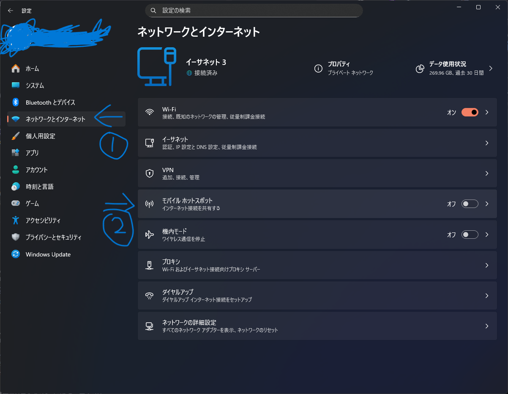
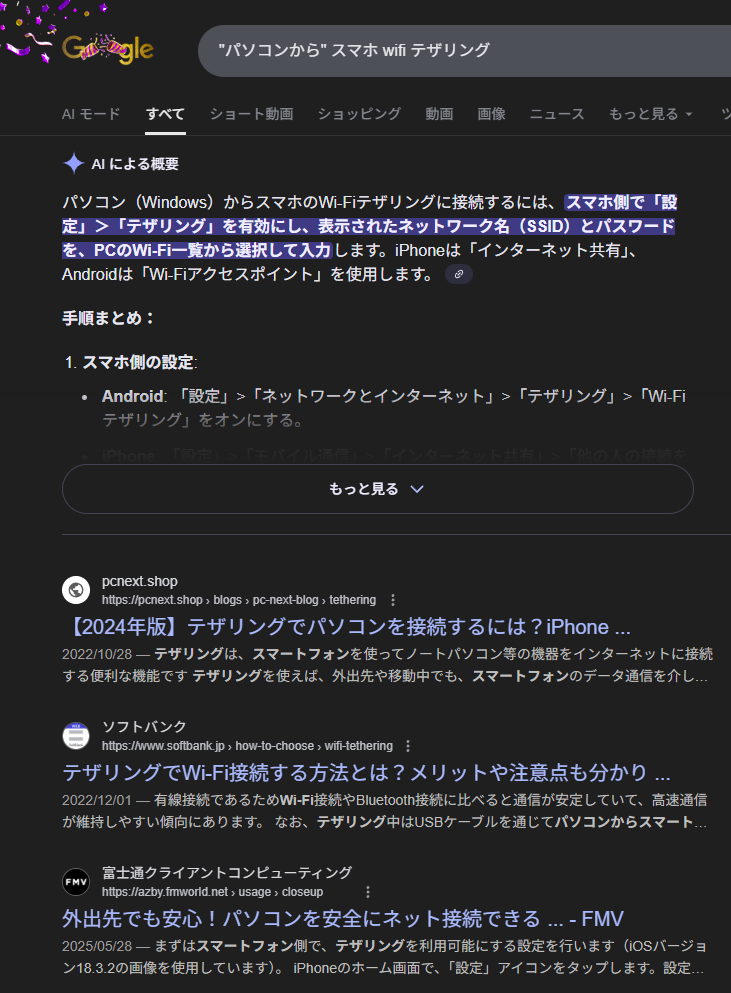

なぜか検索しても一発で出てこなかったので、悩める人たちのために記事にします。

## やり方

> [!WARNING] 注意
> パソコンに無線カードがささっている（無線を受信できる状態である）ことがもちろん前提です。大体受信ができれば送信もできると思います。

これだけです。

ちなみに、ネット共有を無線ですることを「テザリング」といいます。ためになったね～

## 何故か逆の検索結果ばっかり

なんでだよ。