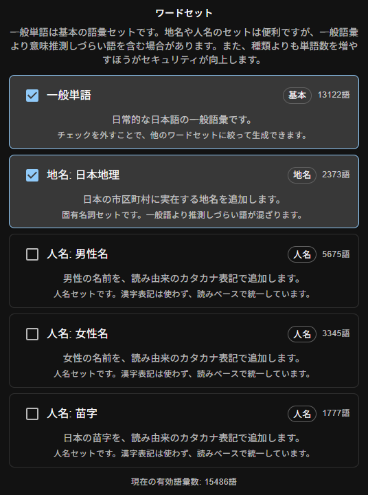

パスワードは闇の文化です。今すぐやめましょう。

と言っても、すべてのサービスからパスワードを根絶しろという話ではありません。まだ無理です。パスワードしか使えないサービスも普通にあります。

この記事で言いたいのは、

**人間がパスワードを考えて、覚えて、入力するのをやめよう**

という話です。

## じゃあどうすんだよ

やることは単純です。

1. 可能な限り、パスキーを使う
2. パスキーが使えないところは、Bitwardenなどのパスワードマネージャーに任せる
3. パスワードマネージャーのマスターパスワードだけ、強いパスフレーズにする

この**金**科**玉**条を守れば、パスワードの苦悩からたちまち解き放たれ、運気の流れが上がり、幸せな人生がやってきます。嘘じゃないです。信じて。

## 前提：パスワードは人間に向いていない

パスワード運用、人間に向いていません。

サービスごとに別々の、長くて、ランダムで、推測できない文字列を用意する必要があります。例えばこういうやつです。

```txt
xK8#vP2qL!z7mN4a
```

あるいは、もうちょっと工夫をした人はこんな感じですかね。

```txt
PassW0rd0204rA-meNumai
```

いや～、完璧なパスワードですね。**覚えられないことを除けば。**

そして、これを量産できるわけもありません。人類はこういうことをします。

* 使い回す
* 末尾の数字だけ変える
* サービス名を混ぜる
* メモ帳に書く
* スクショする

地獄のライフハック集です。

パスワードマネージャーなしでパスワードを管理するのは、**原理的に不可能**です。人類に向いていない作業は、人類がやらないほうがいいです。

## 1：そうだ、パスキーを使おう

そこで、今年急に流行りだしたのが**パスキー**です。

`youtube:https://www.youtube.com/watch?v=Ao2tY0J-xyE`

パスキーというのは、公開鍵アルゴリズムとやらにより「オマエがこのアカウントの所有者だな」を認証できるやつです。パスワードを入れません。

つまり、そもそも盗まれません。賢い。

> [!WARNING] 紛失には注意
> パスキーを入れた端末を盗まれると普通に終わります。でも「10個のパスワードを覚える」のと「ものをなくさないようにする」のどっちが簡単かは、言うまでもないですよね。

### で、パスキーはどこにあるんだい？

パスキーのとっつきにくさは、アルゴリズムの理解というより**保管場所**にあると思います。これについては他の場所に書いておいたのでぜひ読んでみてください。

https://zenn.dev/ao_sankaku/articles/0aec255dec536a

雑に言うと、パスキーはだいたい以下のどこかに保存されます。

* Appleのパスワード
* Googleパスワードマネージャー
* Windows Hello
* Bitwardenなどのパスワードマネージャー
* 物理セキュリティキー

ここを意識せずに「なんかパスキー作れた！わーい！」で突っ走ると、後で「で、俺のパスキーはどこにあるん？？？？」になります。

なので、パスキーを作るときは、**どこに保存したか**をちゃんと見ましょう。機種変更やPC買い替えのときに効いてきます。

## 2：パスキーだけでは終わらない

残念ながら、すべてのサービスがパスキーに対応しているわけではありません。当然、まだパスワードはいります。

そこで**パスワードマネージャー**先輩の出番です。

Bitwarden、1Password、Proton Pass、Appleパスワード、Googleパスワードマネージャーなど、選択肢はいろいろあります。どれでもいいので、とにかく人間がパスワードを覚えるのをやめましょう。

> [!NOTE] Chromeにパスワードを入れるのってどうなの？
> 「Chromeにパスワードを保存するのは危ない」という派閥の人もいますが、それでも使いまわしパスワードよりは100倍安全です。

各サービスのパスワードは、パスワードマネージャーにランダム生成させます。こうすることで、100個近いパスワードを覚えたりする必要がなくなります。

大量にサービスがあるこの世界で、いちいち安全なパスワードを考えるのは不可能に決まっています。パスワードマネージャーに任せましょう。

## 3：では、パスワードマネージャーのパスワードは？

ここでラスボスが出ます。

「パスワードを全部Bitwardenに入れましょう」と言ったとして、そのBitwardenを開くためのパスワードはどうするのか。

これに関しては、仕方なく覚える必要があります。ただし、**これ1個さえ覚えていればOK**です。

ここでおすすめなのは、**パスフレーズを作ること**です。大事なのは、**長く、ランダムで、覚えられる**ことなので、`hogeFuga3398`みたいなものにするよりも`ringo-gorira-rappa-aosankaku-pantsu`のような人間に優しいものを選びましょう。

名前、誕生日、好きな作品名、推し、ハンドルネームなどを混ぜてもいいですが、それはあくまでパスフレーズの一部にしてください。

## 本題：パスフレーズ生成ツールを作りました

というわけで作りました。

https://pasufure-zu.aosankaku.net

日本語のパスフレーズを作るためのジェネレーターです。こんな感じのパスフレーズが一瞬で作れます。

```
gougai-azuki-agezoko-kikai-tsuriai-saji
suki--tameike-ittann-karategata-kagenn-murasakiiro
boke-majinai-zashi-fuso-ko-do-sakotsu
rienn-kikinn-chiyo-buai-akaunnto-hidenn
```

ローマ字には派閥があります（`si`か`shi`かみたいな）が、それにも完全対応です。

「こんなパスワードでいいの？」と思うでしょう。でも、安全です。

### なぜパスフレーズでも安全なのか

パスワードの強さというのは、ざっくり以下の式で決まります。

$$
\text{文字種類}^\text{文字数} = \text{パターン数}
$$

つまり、一番短い`boke-majinai-zashi-fuso-ko-do-sakotsu`は、半角英小文字26文字と「-」とみなすと

$$
26^{37} \risingdotseq 22,595,079,562,450,841,747,875,866,761,397,157,432,416,778,821,042,176
$$

です。これはつまり、「ランダムに当てようと思ったら**2.2恒河沙**通りから1つの正解を見つけないといけない」ということです。

「でも実際は単語じゃん」という気持ちはわかります。そこで、攻撃者がこのツールと、更に間の記号を知っている前提で計算してみましょう。



一般単語のみを選ぶと**13122語**です。ここでは、ランダムに6単語を組み合わせることとしてみます。

$$
13,122^{6} \risingdotseq 5,105,052,356,919,840,631,255,104
$$

です。これは**5.1秭通り**になります。

そしてちなみに、`hogeFuga3398`は半角大小英文字＋数字62通りとすると

$$
62^{12} \risingdotseq 3,226,266,762,397,899,821,056
$$

です。これは**32垓通り**で、大体さっきのパスフレーズの**0.0006倍**のパターン数です。長いだけマシですが、見劣りしますね。

そして、いかにも覚えにくそうな`!ji*k0?+a@`は記号を含めて大体100通りと仮定すると

$$
100^{10} \risingdotseq 100,000,000,000,000,000,000
$$

です。これは**1垓通り**です。悪くはないですが、これが`hogeFuga3398`より弱いというのはなかなか直感に反しますね。でもこれが現実です。

ということで、パスフレーズは短いパスワードよりも圧倒的に安全です。パスフレーズ教に改宗してください。今すぐです。さあ。

## まとめ

**人間に大量のパスワードを管理するのは、逆立ちしても不可能**です。

1. パスワードを保存するサービスを決める（Bitwarden、Protonpassなど）
2. このサービスのパスワードは、パスフレーズにする
3. 何度も入力したり、音読して**これ1つだけ**覚える
4. 残りのサービスのパスワードは、覚えず片っ端から預ける

これが令和最新版の**金**科**玉**条、最強のセキュリティ対策です。

できるだけパスキーにし、残りはBitwardenなどに押し込みましょう。そして、預け先のものを1つだけ、ちゃんとしたパスフレーズにしましょう。

そしてそのパスフレーズ作成には、ぜひこれを使ってください。

https://pasufure-zu.aosankaku.net

このツールがみなさんのお役に立つことを、心から祈っています。