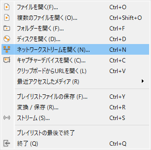
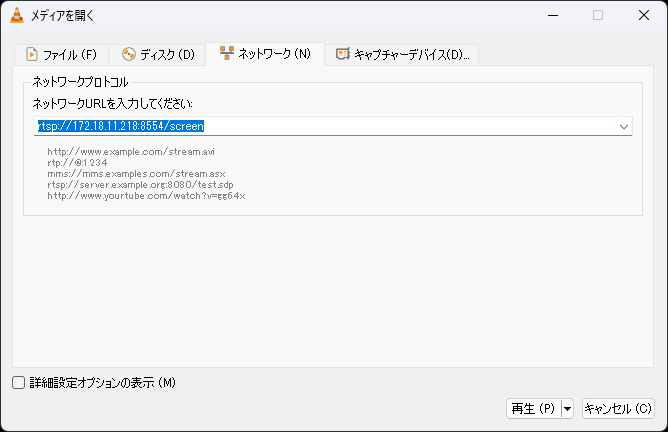
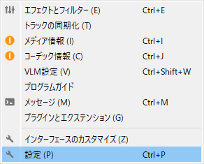
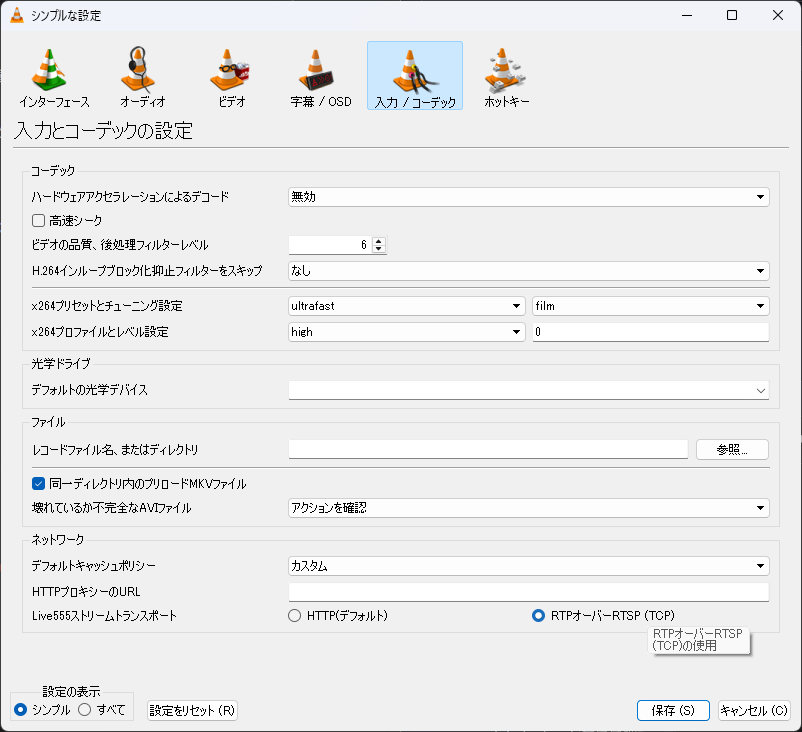

以前、Android（など）の画面をWindowsに映す方法を紹介しました。

https://aosankaku.net/blog/windows_screenshare/

私は、この記事でScrcpyを紹介しておきながら、正直全く使っていませんでした。だって、1回有線接続するのも、IPをいちいち確認するのもめんどくちゃいんだもん。

Scrcpyは遅延も少ないし、PC側からスマホを操作することもできます。めちゃくちゃ便利です。ただ、使うためにはADBを有効にする必要があります。これはどう考えても権限が過剰です。画面をWindowsに表示したいだけなのに。おかしい。

そういうわけ、もう少し単純に画面だけを転送できるアプリを探すことにしました。

## あっさり代替は見つかった

そういうわけで、右腕どころかもはや心臓になりつつあるちゃっぴーくんに`**ScreenStream**なるものを教えてもらいました。優秀でいいね。本当。

https://play.google.com/store/apps/details?id=info.dvkr.screenstream&hl=ja

ScreenStreamは、Androidの画面をネットワーク経由で配信できるオープンソースのアプリです。こういうものがFLOSSで出てきてくれるのは本当に嬉しい。

ブラウザで見られるMJPEGモードもありますが、今回は画面共有に余計なものを移したくなかったので**RTSPモード**を使いました。RTSPというのは、ネットワークカメラや監視カメラなどでよく見かけるストリーミング用のプロトコルらしいです。

正確には、RTSPが映像を直接運んでいるというより、配信の開始や停止などを制御し、実際の映像はRTP（りあるたいむとらんすぽーとぷろとこる）で送る構成が一般的とのことです。画面を送ろうとしたら急に監視カメラの人になった気分ですが、とりあえず動けばええでしょう。

ScreenStreamでRTSPサーバーを開始し、表示されたURLをVLCの「メディア→ネットワークストリームを開く」に入力します。

ScreenStreamで「RTSP mode」にすれば接続情報は出るので、それを入れるだけです。

これだけでAndroidの画面がWindowsに表示されました。USBケーブルもADBも不要です。これはいい感じです。

## 最初の1分くらいしかまともに動かない

ところがどっこい、しばらく使っていると問題が発生しました。

配信を開始した直後はスムーズに動くのですが、1分くらい経過すると映像が強制停止します。こりゃ一転して使い物になりません。

最初はネットワークキャッシュが足りないのかと思いVLCの「ネットワークキャッシュ」の値を増やしてみましたが、ほとんど変化はありません。遅延だけ増えました。

## VLCのLive555ストリームトランスポートを変更する

私の心臓に尋ねてみた結果、色々疑ったものの**VLCのストリームトランスポート**が怪しいということになりました。変更したら安定しました。

VLCで以下の順番に設定を開きます。

1. 「ツール」から「設定」を開く
2. 「入力／コーデック」を選択する
3. 下部にある「ネットワーク」を確認する
4. 「Live555ストリームトランスポート」を変更する

デフォルトでは`HTTP`が選択されているため、これを`RTPオーバーRTSP（TCP）`に変更します。

設定を保存してストリームを開き直したところ、とりあえず止まらなくなりました。

> [!TIP] RTPオーバーRTSPとは
> `RTPオーバーRTSP（TCP）`では、映像に使われるRTPやRTCPのパケットをRTSPのTCP接続に載せて送ります。
> RTSPの制御通信と映像の通信を、同じTCP接続上に多重化する方式です。RTSP interleavedと呼ばれることもあるようです。
> ネットワークやファイアウォールの構成によっては、映像用の通信を別に扱う方式よりも安定する場合があります。
>
> by GPT-5.6 Sol (High)

今回途切れていた正確な原因までは調べていませんが、まあ動けばええでしょう。

ScreenStream、VLC、Wi-Fi環境のどこで問題が発生していたのかは不明です。少なくとも私の環境では、ネットワークキャッシュを増やすよりも、この設定を変更するほうが効果がありました。

## そもそも、VLC以外を使ったほうがいい可能性もある

ScreenStreamの公式READMEでは、RTSPの再生ソフトとして以下が挙げてあります。

- VLC
- FFplay
- mpv
- gst-play-1.0

VLCはGUIで簡単に開けるので使っていますが、RTSPを受け取るだけなら`mpv`や`FFplay`のほうが扱いやすい可能性もあります。特にコマンドラインから起動する場合は、トランスポート方式などの設定を起動オプションとして固定しやすそうです。

とはいえ、VLCの設定を変更したら普通に動くようになったため、面倒になってまだ試していません。暇な人はやってみたらいいんじゃないでしょうか（丸投げ）。

---

~~ちなみに、iPhoneの画面をWindowsに簡単に配信する方法は多分ないです。前の記事を読み、苦悶の表情で挑戦してみてください。私はもうやりたくありません。~~

**iPhone/iPadでも楽にできる方法を見つけちゃいました**。こっちから読めます。

https://aosankaku.net/blog/never_use_default_uxplay/