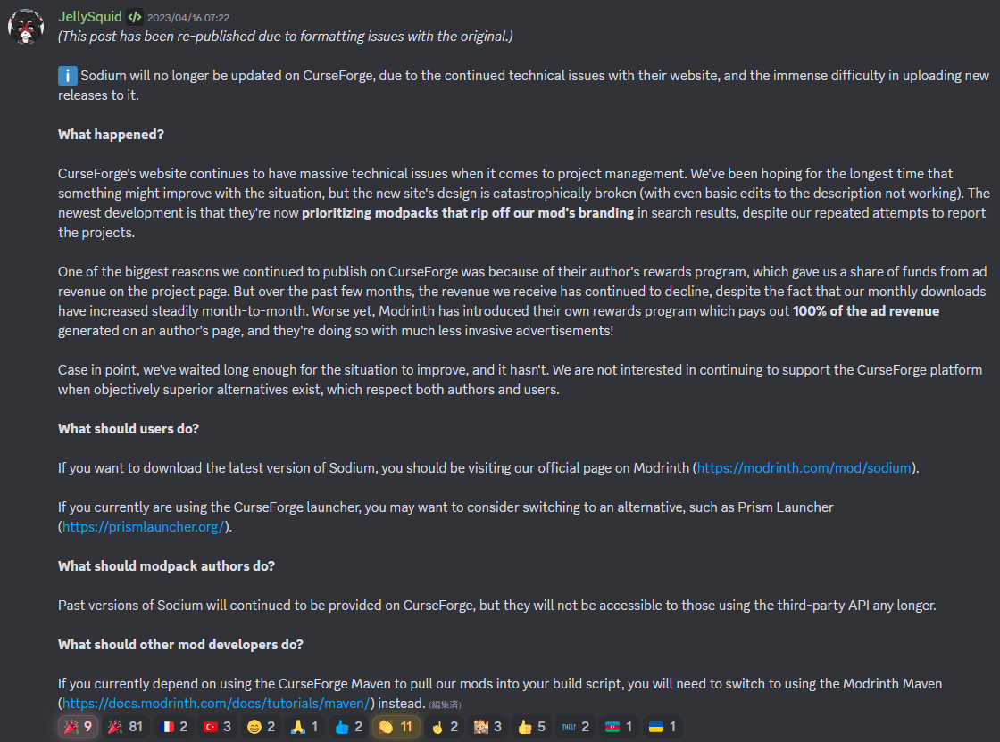
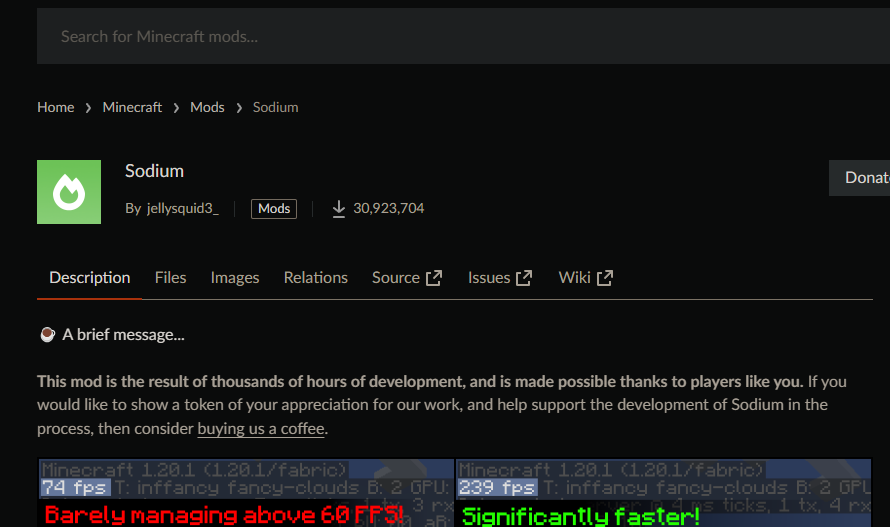
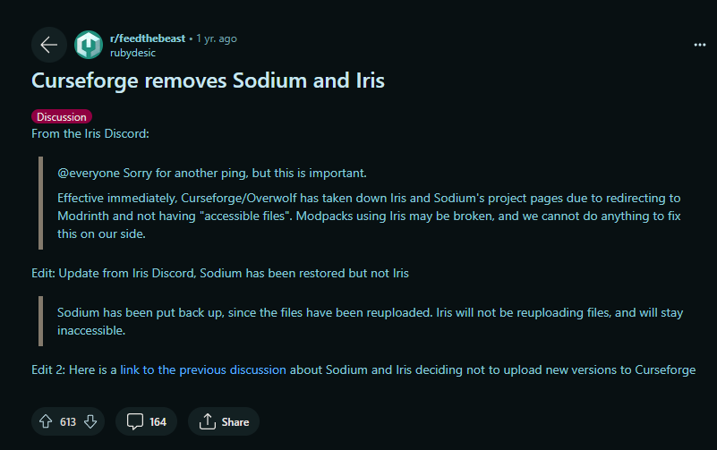
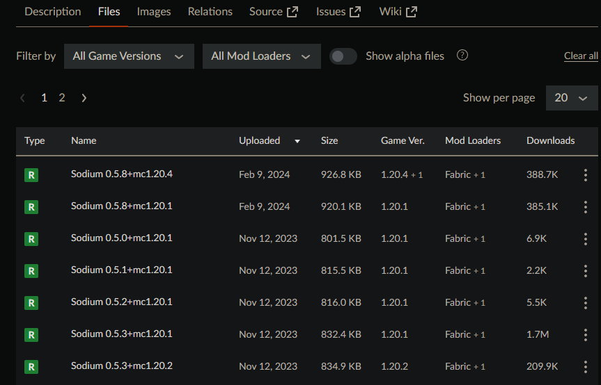
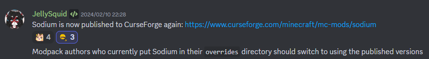
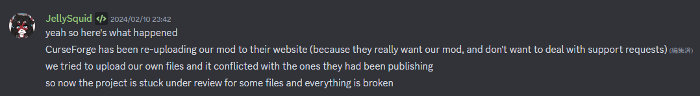

---

title: "[Minecraft] Sodium Quietly Returned to CurseForge"
category: "Minecraft"
date: "2026-07-24T23:11:00+09:00"
originalDate: "2024-04-01T03:30:00+09:00"
desc: "Sodium, which had previously been available only on Modrinth, quietly returned to CurseForge at some point. This article summarizes what happened."
tags:
- Fabric
- Sodium
- Mod
- CurseForge
- Modrinth

---

> [!NOTE]
> This article was initially translated with GPT-5.6 and then reviewed and edited by the author.

This article happened to be published on April Fools’ Day, but it is not a joke.

## Sodium was available only on Modrinth for a long time

This announcement had been displayed since around April 2023.

<blockquote class="twitter-tweet">
CurseForgeのSodiumのページで、こんなものが表示されてしまう日が来るなんて思っていなかった &quot;Sodium is no longer available on CurseForge!&quot;ですか... これからは、Modrinthからダウンロードする時代になるのか... <a href="https://t.co/ca2c3SVNWe">pic.twitter.com/ca2c3SVNWe</a>
&mdash; 🐻白くまさん🐱 (@abc_kuma1025) <a href="https://twitter.com/abc_kuma1025/status/1648944930172325889?ref_src=twsrc%5Etfw">April 20, 2023</a></blockquote> 

As this post shows, the CurseForge page clearly said, “Sodium is no longer available on CurseForge!”

### Why?

This post explains the reasons. To summarize it roughly:

* CurseForge had many technical problems and was not doing enough to improve them
* It was also allegedly harming the Sodium brand through modpacks
* Most importantly, CurseForge’s rewards were decreasing even though the number of mod downloads was increasing
* Modrinth, on the other hand, was modern and gave creators **100% of the advertising revenue allocated to their projects**

That seems to have been the situation.

Other mod developers also began distributing their mods exclusively through Modrinth for similar reasons.

### Did the notice disappear from CurseForge?

I checked the page today, April 1, 2024, and noticed that the message had disappeared.

What happened?

### CurseForge had restricted the project

Source: https://www.reddit.com/r/feedthebeast/comments/12oopaq/curseforge_removes_sodium_and_iris/

According to this Reddit post, CurseForge stopped publishing Sodium and Iris because their pages linked users to Modrinth, an external download site, and because the projects did not correctly configure files marked as “available.”

### Updates had resumed in November

Looking at the update history, new versions had been appearing since November. It seems that the suspension of updates ended around that time.

### There was a very quiet announcement

After searching through Discord, I found a rather understated announcement.

This did not mean that JellySquid, the developer of Sodium, had reached some kind of agreement with CurseForge.

JellySquid did not appear particularly pleased about the situation and did not make a large announcement about it. The screenshot above was not posted in an important-looking channel such as `announcements`, but in `dev-sodium`, a channel normally used for casual development discussion.

### Incidentally, CurseForge was updating Sodium on its own

If the contents of this message are accurate, CurseForge was uploading and updating Sodium **on its own**.

Worse, this apparently made it **impossible for the developer to upload updates personally**. That is a terrible situation.

Sodium is an extremely popular mod, so I assume CurseForge also wanted its downloads, page visits, and resulting advertising revenue.

Still, that is quite a thing to do.

## Conclusion: What should we do?

**Whenever possible, download Sodium from Modrinth.**

Doing so allows JellySquid to receive more compensation and respects the developer’s preferred distribution method.

The official download page is here:

https://modrinth.com/mod/sodium

It may be better to download other mods from Modrinth whenever possible as well. Personally, I also try to install mods from Modrinth when I can. The site is easy to use.

The lack of Japanese language support is a slight drawback, though.

## Note

All Discord screenshots above were taken from the [official Sodium Discord server](https://caffeinemc.net/discord).
